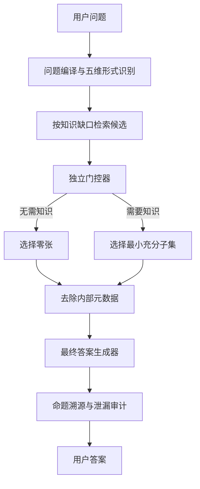

# 群学致知训练集制作完整需求、质量标准与数据形式总协议

版本：v1.0（汇总基线）

协议日期：2026-08-12

汇总交付日期：2026-08-13

适用基线：训练集协议 v0.5 + 知识门控增强 v0.6

适用对象：案例设计者、资料搜集者、社会学标注者、知识库工程师、训练工程师、评测人员与验收人员

文档性质：可直接执行的生产总协议；其中明确区分“硬规则”“当前数值基线”和“待实验校准项”

---

## 0. 文档结论

群学致知训练集的真实逻辑单位不是一条问答，而是一个可追溯的“母案例”。每个母案例必须同时保存：

1. 原始问题及材料；
2. 问题内部的节点与关系；
3. 五维形式构成及其不等比例；
4. 独立于形式构成的知识缺口与知识门控；
5. 命题—证据—来源关系；
6. 已知、未知、停止条件与推进方式；
7. 去除内部标识后的答案简报；
8. 面向用户的自然答案；
9. 来源、专家审核、泄漏检查与版本状态。

训练时再由母案例派生为不同原子任务、知识门控任务、答案投影任务和偏好对。不得直接把同一母案例派生出的多条记录当作多个独立案例，也不得把候选知识全集直接交给最终答案生成器。

完整能力链如下：


### 0.1 三类协议状态

| 状态 | 含义 | 本文中的典型内容 |
|---|---|---|
| 硬规则 | 不满足即不得进入训练 | 形式/知识分离、允许零选卡、来源角色边界、停止协议、内部 ID 泄漏为 0、家族与来源隔离 |
| 当前数值基线 | v0.5/v0.6 生产按此执行，变更必须升版并重新验证 | 五维 42% 最低阈值总量 + 58% 波动量、具体最低阈值向量、300 母案例阶段目标 |
| 待校准参数 | 可作为启动先验，不能宣称为已证明的全局最优解 | 30:40:30 SFT 能力配比、知识需求比例、部分分层配额与消融范围 |

---

## 1. 目标、用途与非目标

### 1.1 训练目标

训练集用于让模型获得以下区别于通用对话模型的稳定能力：

- 将一个具体社会问题识别为对象、行动者、层级、关系、命题、规范前提、未知与推进要求组成的结构；
- 在同一问题中识别本体论、实践论、方法论、价值论、认识论五种功能，但不把问题机械切成五段；
- 判断每一维在具体问题中的最低必要作用、主次关系和动态增量；
- 判断什么时候需要知识、需要什么知识、应拒绝什么知识以及什么时候一张知识卡都不选；
- 将每个拟输出命题绑定到题面、可接受的内部知识、经核验的公开来源、推论、价值判断或未知状态；
- 在证据不足时真正改变行为：收缩结论、追问、提出最小推进步骤或停止，而不是口头承认“不确定”后继续给出强结论；
- 将内部结构自然投影为一个结论优先、边界明确、无内部标签的用户答案。

### 1.2 允许的任务范围

包括但不限于：

- 社会现象解释与概念辨析；
- 经验研究结论审校；
- 因果、机制、外部效度和层级越界判断；
- 定量、质性、混合方法的设计与误用判断；
- 规范冲突与价值前提辨识；
- 研究方案、治理方案和行动路径设计；
- 资料不足、来源冲突、版本冲突和不可回答问题；
- 基于公开网络资源构造的事实、方法与理论问题。

### 1.3 非目标

训练集不用于：

- 让模型固定输出五个标题或五段式答案；
- 让知识库资产数量决定五维重要性；
- 训练不可审计的长思维链；
- 用未经核验的标题、链接或二手摘要替代原始证据；
- 让模型在所有问题上给出全部可能答案空间；
- 用同一套机械模板覆盖所有社会问题；
- 在未经专家批准时把模型重构稿称作最终金标；
- 直接用于医疗、法律、金融等高风险专业决策而不增加相应领域审核。

---

## 2. 五维定义与功能边界

五维不是五类文章主题，也不是五个必须显式出现的答案段落，而是一个具体问题内部的五种功能坐标。

### 2.1 D1 本体论

回答“问题中的什么以何种方式存在并发生关系”。重点包括：

- 对象与行动者是什么；
- 个体、组织、制度、结构、文化、技术等层级如何区分；
- 关系、机制、类别和边界如何界定；
- 是否把指标、标签、统计模式或话语误当作实体；
- 是否发生个体—群体、局部—整体、描述—机制之间的本体滑移。

本体论的作用是确定问题本身的结构。例如，一个冲突可被判断为能动性结构下的冲突，而不是简单的个人态度分歧。

### 2.2 D2 实践论

回答“在现实约束下如何推进、实施、调整和反馈”。重点包括：

- 行动者可以采取什么步骤；
- 资源、制度、时间、风险和参与约束是什么；
- 如何把未知转化为调查、比较、试点、治理或协商流程；
- 干预如何记录、复核和更新；
- 何时应停止、回退或改变方案。

实践论不是泛泛的“给建议”，而是把结构判断和认识缺口转化为可执行、可复核的推进。

### 2.3 D3 方法论

回答“以何种方法能够支持何种判断”。重点包括：

- 研究设计、抽样、测量、编码和比较是否匹配问题；
- 资料单位、分析单位和推断单位是否一致；
- 关联、预测、机制和因果是否被混淆；
- 定量、质性与混合方法的适用边界；
- 结果对样本、时间、场域和操作化的依赖；
- 替代解释、稳健性和反事实要求。

### 2.4 D4 价值论

回答“判断依据包含何种应然前提，价值冲突如何被辨识”。重点包括：

- “重要”“公平”“自由”“有效”“正常”等判断依赖什么价值；
- 哪些价值属于题面给定，哪些是模型或研究者额外带入；
- 不同正当价值之间如何冲突；
- 哪些经验事实不能直接推出规范裁决；
- 如何说明价值依据而不替用户作未经授权的最终裁决。

例如，对自由的判断可能基于“人应当具有能动性和自由性”这一规范前提。价值维应揭示此前提，而不是把它伪装成经验事实。

### 2.5 D5 认识论

回答“当前能知道什么、不能知道什么以及怎样更新”。重点包括：

- 题面给定、来源支持、推论、假设、规范判断和未知的区别；
- 证据强度、适用范围和置信程度；
- 何种新资料会改变结论；
- 何时应校准、追问或停止；
- 来源冲突、时效差异和证据质量如何处理。

### 2.6 五维之间的基本关系

必须同时遵守：

1. 任一具体问题都包含五维最低功能，v0.5 之后不再使用 `off` 取消某一维的形式存在；
2. 五维在一个问题中的权重不均等；
3. 五维权重表示功能优先级和约束强度，不表示答案字数比例；
4. 一个问题可以有明确主维，但主维不垄断答案；
5. 不是所有维度都必须得到波动增量，但获得增量的维度必须多于一个；
6. 维度是否显式写进用户答案与其内部存在是两回事；
7. 不得按知识库中各维条目数量反推问题的五维比例；
8. 不得用“五维出现次数”判断答案强弱。

---

## 3. 五维形式比例模型

### 3.1 当前计算形式

对每个母案例，五维最终形式权重记为：

\[
w_i=b_i+0.58p_i
\]

其中：

- `b_i`：第 i 维最低阈值；
- `p_i`：第 i 维获得的波动量份额；
- `Σb_i = 0.42`；
- `Σp_i = 1`；
- `p_i ≥ 0`；
- `Σw_i = 1`。

当前最低阈值向量为：

| 维度 | 最低阈值 `b_i` | 占五维总量 |
|---|---:|---:|
| D1 本体论 | 0.0990566038 | 9.9057% |
| D2 实践论 | 0.0633962264 | 6.3396% |
| D3 方法论 | 0.0792452830 | 7.9245% |
| D4 价值论 | 0.0792452830 | 7.9245% |
| D5 认识论 | 0.0990566038 | 9.9057% |
| 合计 | 0.4200000000 | 42% |

剩余 58% 是随具体问题变化的受约束波动量。

### 3.2 数学约束

每个案例都必须通过：

- 至少两个 `p_i > 0`；
- 按 `p_i` 从大到小排列后，`p_(1) ≤ 2 × p_(2)`；
- `max(w_i) < 0.49`；
- `|Σp_i - 1| ≤ 1×10^-6`；
- `|Σw_i - 1| ≤ 1×10^-6`；
- 每维 `w_i ≥ b_i`；
- 排名、状态与数值一致。

这些约束表达三项要求：

1. 最低阈值不全相等，阈值之和不占绝对主导，但单一维度不能成为可忽略项；
2. 波动量不必分给五个维度，但必须分给一个以上维度；
3. 波动后不能出现单一维度的绝对垄断。

### 3.3 维度状态

按每案最终权重和排序记录：

- `leading`：本题的主要功能轴；
- `elevated`：承担必要的次级功能；
- `baseline`：保持最低功能但不获得额外增量。

`output_visibility` 单独记录为：

- `explicit`：用户答案中应明确体现；
- `implicit`：功能进入答案，但不单独命名；
- `none`：内部约束已满足，无需在当前答案中可见。

禁止把 `baseline` 理解为无用，也禁止把 `none` 理解为该维不存在。

### 3.4 数值基线的版本地位

42:58 和上述阈值向量是 v0.5/v0.6 的当前生产基线，已经满足既定不等关系，但不是由形式系统单独证明的永恒定理。若要修改，必须：

1. 新建协议版本；
2. 保留原版本对照；
3. 重跑形式约束验证；
4. 对封闭集做消融；
5. 同时报告总分、边界安全、五维分层稳定性和自然投影；
6. 只有多项指标共同改善时才能替换当前基线。

建议优先比较阈值总量 38:62、40:60、42:58、45:55，以及不同阈值形状和 `top1/top2` 上限。

---

## 4. 形式剖面与知识剖面必须分离

### 4.1 两种剖面的区别

`formal_profile` 回答：这个问题本身需要五维分别承担多少功能。

`knowledge_profile` 回答：为了完成这些功能，当前模型还缺什么外部或内部知识。

形式权重高不代表必须检索更多知识；形式权重低也不代表该维不能出现关键知识缺口。

### 4.2 知识调用权重

对每维知识缺口记为 `g_i`，知识调用权重可按下式计算：

\[
k_i=\frac{w_i g_i}{\sum_j w_j g_j}
\]

若所有 `g_i=0`，则所有 `k_i=0`，正确动作是选择零张知识卡。

### 4.3 硬规则

- 不得按 D1—D5 各取一张卡；
- 不得为了“覆盖五维”强行选卡；
- 最小知识子集必须可变长，允许为 0；
- 每张被接受的知识必须绑定到具体问题节点或答案命题；
- 相关不等于必要，必要不等于可公开引用；
- 候选全集不得进入最终生成器；
- 被拒绝卡不得进入最终生成器；
- 最终生成器只接收题面和通过门控、去除内部元数据后的纯内容。

---

## 5. 原子能力清单

训练集应覆盖以下原子能力。它们可以由同一母案例派生，但必须有独立监督信号。

### 5.1 问题编译能力

1. 陈述角色识别；
2. 问题、材料与待审主张分离；
3. 对象、行动者、层级、关系和范围识别；
4. 经验给定、推断、规范前提、未知和行动要求识别；
5. 主张拆解和问题图构建；
6. 单位、尺度、时间与情境边界审校。

### 5.2 五维识别能力

1. 每维绑定到具体问题节点；
2. 为每维说明本题功能，而不是复述维度定义；
3. 计算最低阈值、波动份额和最终权重；
4. 判断主维、次维和基线维；
5. 检查维度间不等式；
6. 判断哪些功能应显式、隐式或不进入答案；
7. 识别错误主维、机械五分法和维度越权。

### 5.3 知识门控能力

1. 判断是否需要知识；
2. 将知识需求绑定到问题节点、缺口和成功条件；
3. 对每张候选卡做功能、范围、来源角色硬门控；
4. 区分接受、暂存和拒绝；
5. 选择最小充分子集；
6. 在题面充分时选择零张；
7. 拒绝词面相关但层级、场域、方法或时间不匹配的知识；
8. 拒绝超过来源支持范围的用法。

### 5.4 命题与认识控制能力

1. 将答案命题绑定到依据；
2. 区分 `given / supported / inferred / hypothesis / normative / unknown`；
3. 区分来源定位符、内部知识和可公开引用来源；
4. 指定禁止推出的命题；
5. 识别可直接回答、需校准、需追问和必须停止；
6. 将未知转化为实际的语言行为和下一步。

### 5.5 答案投影能力

1. 结论优先；
2. 只使用题面与已通过门控的内容；
3. 自然协同五维功能；
4. 不出现 D1—D5、内部卡号、文件路径和审核字段；
5. 不把辅助知识写成“题面材料显示”；
6. 不把内部知识伪装成公开来源；
7. 不机械分五段；
8. 在边界处收缩、追问或停止；
9. 给出最小充分的推进步骤，避免无效冗长。

### 5.6 偏好辨别能力

模型应稳定偏好：

- 最小充分知识而非候选全集；
- 零选择而非强行选卡；
- 有边界的窄结论而非机制或因果越界；
- 自然整合而非机械五段式；
- 已核验来源而非来源定位符；
- 去内部标识答案而非卡号泄漏；
- 真正停止而非“虽不确定但仍断言”；
- 简洁有效而非堆砌知识。

---

## 6. 案例来源与材料制作标准

### 6.1 来源政策

当前数据生产可完全使用网络可搜索的公开资源，不要求线下访谈或自行采集。优先级为：

1. 原始研究论文、官方报告、正式数据文档和权威机构页面；
2. 有稳定 DOI、版本号或永久链接的开放来源；
3. 许可清晰、允许当前用途的内容；
4. 能核验正文或摘要中具体支持范围的来源；
5. 二手报道只可作为线索，不应替代原始来源。

### 6.2 每个来源至少保存

- `source_locator_id`；
- 标题；
- 作者或机构；
- 发布年份/日期；
- DOI 或稳定 URL；
- 来源类型；
- 许可或权利状态；
- 版本/访问日期；
- 核验状态；
- 允许承担的证据角色；
- 可支持命题；
- 不可推出命题；
- 事实锚点或原文定位；
- 来源家族标识。

### 6.3 来源角色

必须区分：

| 角色 | 可做什么 | 不可做什么 |
|---|---|---|
| `case_locator_only` | 帮助找到原文和复核案例 | 不能当作已接受证据 |
| `internal_constraint` | 在内部约束概念或方法边界 | 不能自动作为用户可见引文 |
| `accept_citable` | 在人工核验的支持范围内对外引用 | 不能扩展到未核验命题 |
| `material_fact` | 作为题面明示材料使用 | 不能被改写为更强的经验或因果断言 |

只有标题和 URL 时，默认 `hold_unverified`、`usable_as_evidence=false`。

### 6.4 新案例文本要求

网络来源构造的新案例至少包括：

- 中文标题；
- 材料；
- 用户问题；
- 待审主张或明确任务目标；
- 来源定位；
- 3—5 个可在原始摘要或正文中逐字定位的事实锚点；
- 材料未给出的关键未知；
- 正确推进方向。

当前开放来源批次采用的硬审计窗口，可作为默认生产标准：

- 材料：180—420 个中文字符；
- 问题：18—70 个中文字符；
- 待审主张：20—90 个中文字符；
- 事实锚点：3—5 个，必须是来源中的连续片段；
- 同源或跨源近重复必须检测；
- 例外必须在 `review.exception_reason` 中记录并经人工批准。

### 6.5 主张制作要求

待审主张应当是一个真实可犯、具有辨别力的错误或争议，而不是故意荒谬的稻草人。优先包括：

- 由相关跳到因果；
- 由结果跳到未测机制；
- 由样本内结果跳到总体或跨情境结论；
- 由指标跳到实体属性；
- 由经验差异跳到道德评价；
- 由方法工具跳到方法有效性；
- 由平均趋势抹去异质性；
- 由题面不足强行给出确定答案；
- 把价值前提隐藏为事实；
- 把可执行建议写成无条件普遍方案。

### 6.6 旧案例迁移政策

若使用 v0.2、v0.3 或其他旧训练集，允许继承的只有：

- 标题；
- 材料；
- 问题；
- 待审主张；
- 公开来源标题与 URL，且只能先作为未核验定位符。

必须全部重写：

- 旧答案；
- 五维标注；
- 形式比例；
- 候选知识与最小子集；
- 门控决策；
- 命题图；
- 认识状态；
- 数据切分；
- 审核状态；
- 训练任务与偏好对。

正式构建器不得直接读取旧版完整训练文件，只能读取隔离后的 `case_only_pool.jsonl`。

---

## 7. 母案例的数据形式

### 7.1 基本原则

- 每行一个 JSON 对象，UTF-8，格式为 JSONL；
- `case_id` 全局唯一；
- `family_id` 代表同源、同题或可互相泄漏的案例家族；
- 同一母案例的所有派生任务必须保持同一 `split`；
- 金标和公开输入分离；
- 所有字段必须带版本与审核状态；
- 不保存不可审计的长思维链，只保存短结构决策和可核对理由。

### 7.2 完整字段表

| 一级字段 | 必填 | 功能 |
|---|---|---|
| `schema_version` | 是 | 数据结构版本 |
| `content_version` | 是 | 内容构建版本 |
| `case_id` | 是 | 母案例唯一编号 |
| `family_id` | 是 | 家族隔离编号 |
| `split` | 是 | `train/development/closed_test` |
| `case_origin` | 是 | 来源、旧案例定位或新制批次 |
| `title` | 是 | 中文短标题 |
| `material` | 是 | 题面材料 |
| `question` | 是 | 用户问题 |
| `claim_to_audit` | 条件必填 | 待审主张；非审校题可用 `task_goal` |
| `task_goal` | 是 | 希望模型完成的具体任务 |
| `issue_mode` | 是 | 问题模式 |
| `method_archetype` | 是 | 方法家族/研究形态 |
| `methodological_orientation` | 是 | 后实证、解释、批判或实用取向 |
| `source_links` | 是 | 来源定位与核验状态 |
| `problem_graph` | 是 | 问题节点、关系、范围与陈述角色 |
| `formal_profile` | 是 | 五维最低阈值、波动和最终权重 |
| `knowledge_profile` | 是 | 知识缺口、候选门控与最小子集 |
| `claim_graph` | 是 | 答案命题、依据、来源角色和认识状态 |
| `epistemic_control` | 是 | 可回答性、已知、未知、停止与推进 |
| `answer_brief` | 是 | 去标识化的最小答案依据 |
| `projected_answer` | 是 | 用户可见自然答案 |
| `review` | 是 | 专家、来源、泄漏和可训练状态 |

### 7.3 问题模式枚举

至少覆盖：

- `direct_answer`；
- `overclaim`；
- `method_misuse`；
- `insufficient`；
- `normative_conflict`；
- `conceptual_confusion`；
- `action_design`；
- `measurement_or_category_collapse`；
- `prediction_or_context_transfer`；
- `evidence_quality_dismissal`。

### 7.4 推荐母案例 JSON 骨架

```json
{
  "schema_version": "qunxue_training_v1.0",
  "content_version": "batch-YYYYMMDD-r1",
  "case_id": "MC-0001",
  "family_id": "FAM-0001",
  "split": "train",
  "case_origin": {
    "type": "new_open_source",
    "batch": "B01",
    "legacy_locator": null
  },
  "title": "",
  "material": "",
  "question": "",
  "claim_to_audit": "",
  "task_goal": "",
  "issue_mode": "overclaim",
  "method_archetype": "cross_sectional_observational",
  "methodological_orientation": "postpositivist",
  "source_links": [
    {
      "source_locator_id": "SRC-0001",
      "title": "",
      "url": "",
      "doi": "",
      "license": "",
      "verification_status": "verified_scope",
      "allowed_role": "accept_citable",
      "supports": [],
      "does_not_support": [],
      "fact_anchors": []
    }
  ],
  "problem_graph": {
    "problem_types": [],
    "nodes": [
      {
        "node_id": "N1",
        "type": "material_record",
        "text": ""
      }
    ],
    "relations": [
      {
        "source": "N1",
        "relation": "limits",
        "target": "N2"
      }
    ],
    "scope": {
      "population": "",
      "time": "",
      "place": "",
      "unit_of_analysis": ""
    },
    "statement_roles": []
  },
  "formal_profile": {
    "model": "w_i=b_i+0.58*p_i",
    "floor_sum": 0.42,
    "fluctuation_mass": 0.58,
    "support_count": 2,
    "ranking": ["D3", "D5", "D1", "D4", "D2"],
    "dimensions": [
      {
        "dimension": "D1",
        "dimension_name": "本体论",
        "base_floor": 0.0990566038,
        "fluctuation_share": 0.0,
        "formal_weight": 0.0990566038,
        "state": "baseline",
        "output_visibility": "implicit",
        "bound_problem_node_ids": ["N1"],
        "function": "",
        "completion_criterion": ""
      }
    ],
    "constraint_audit": {
      "p_sum": 1.0,
      "positive_dimensions": 2,
      "top1_to_top2_ratio": 2.0,
      "max_formal_weight": 0.4659,
      "passed": true
    },
    "annotation_basis": "expert_or_reconstructed"
  },
  "knowledge_profile": {
    "knowledge_required": true,
    "target_subset_size": 2,
    "dimensions": [
      {
        "dimension": "D1",
        "gap_score": 0.0,
        "knowledge_call_weight": 0.0,
        "knowledge_state": "none",
        "query_intents": []
      }
    ],
    "retrieval_targets": [],
    "candidate_decisions": [],
    "minimal_knowledge_subset_ids": [],
    "coverage_edges": [],
    "external_source_claims_accepted": [],
    "citation_rule": ""
  },
  "claim_graph": {
    "claims": [
      {
        "claim_id": "AC1",
        "type": "material_fact",
        "text": "",
        "epistemic_state": "given",
        "derived_from": ["N1"],
        "source_ids": [],
        "visibility": "explicit"
      }
    ],
    "evidence_links": [],
    "source_roles": []
  },
  "epistemic_control": {
    "answerability": "answerable_with_calibration",
    "known": [],
    "unknown": [],
    "stop_conditions": [],
    "prohibited_claims": [],
    "next_steps": []
  },
  "answer_brief": {
    "opening": "",
    "supported_material": [],
    "accepted_knowledge_content": [],
    "epistemic_boundary": [],
    "value_premise": [],
    "conclusion": "",
    "next_steps": [],
    "external_citations": [],
    "knowledge_visibility_rule": "internal IDs and rejected candidates omitted"
  },
  "projected_answer": "",
  "review": {
    "status": "model_reconstructed_draft",
    "expert_approval_required": true,
    "source_reviewed": false,
    "formal_profile_reviewed": false,
    "minimal_subset_reviewed": false,
    "leakage_checked": true,
    "training_approved": false,
    "reviewer_ids": [],
    "notes": []
  }
}
```

实际文件中的 `formal_profile.dimensions` 必须恰有 D1—D5 五项；骨架仅展示 D1，不能照样省略其余四维。

---

## 8. 知识条目、候选卡与来源注册形式

### 8.1 知识索引 `knowledge_index.jsonl`

每条至少包含：

```json
{
  "knowledge_id": "KB-D3-0001",
  "dimension": "D3",
  "dimension_name": "方法论",
  "local_id": "M001",
  "title": "",
  "content_excerpt": "",
  "bibliographic_evidence": [],
  "support_scope": "",
  "does_not_support": [],
  "locator": {
    "relative_file": "",
    "heading": ""
  },
  "source_version": "",
  "review_status": "knowledge_source_imported"
}
```

### 8.2 候选知识 `knowledge_candidates.jsonl`

每个案例—候选对一条记录：

```json
{
  "case_id": "MC-0001",
  "candidate_id": "KB-D3-0001",
  "candidate_type": "internal_knowledge",
  "dimension": "D3",
  "title": "",
  "content_excerpt": "",
  "support_scope": "",
  "locator": {},
  "url": null,
  "decision": "accept_internal",
  "reason": "",
  "bound_problem_node_ids": ["N3"],
  "bound_claim_ids": ["AC2"],
  "hard_gates": {
    "function_match": true,
    "scope_match": true,
    "source_role_valid": true
  },
  "review_status": "model_reconstructed_draft"
}
```

### 8.3 门控状态

- `accept_internal`：可用于内部判断，不能自动公开引用；
- `accept_citable`：来源和支持范围已核验，可在限定范围内引用；
- `hold`：相关但非最小必要，或适用范围尚未确认；
- `reject`：功能、范围、层级、时间、场域或来源角色不匹配。

每个决定必须写出具体原因，不接受“相关”“不相关”这种不可审核理由。

### 8.4 最小充分子集

最小充分子集必须同时满足：

1. **充分性**：覆盖回答所必需的全部知识缺口；
2. **最小性**：移除任意一张被选卡后，至少一个必要命题或节点失去支持；
3. **排他性**：未选卡不能通过“增加背景”之名混入；
4. **边界性**：每张卡只能支持标注范围内的命题；
5. **零选择**：题面已经充分时，空集是合法且优先的选择。

### 8.5 来源注册 `source_registry.jsonl`

```json
{
  "source_locator_id": "SRC-0001",
  "source_family_id": "SRCF-0001",
  "title": "",
  "authors_or_org": "",
  "date": "",
  "url": "",
  "doi": "",
  "source_type": "journal_article",
  "license": "",
  "accessed_at": "",
  "verification_status": "verified_scope",
  "allowed_role": "accept_citable",
  "citable": true,
  "supported_claims": [],
  "unsupported_claims": [],
  "fact_anchors": [],
  "reviewer": ""
}
```

---

## 9. 派生 SFT 训练记录形式

### 9.1 通用包络

所有 SFT 文件统一采用：

```json
{
  "record_id": "MC-0001-T01",
  "case_id": "MC-0001",
  "family_id": "FAM-0001",
  "split": "train",
  "subsystem": "compiler",
  "task": "statement_role_classification",
  "messages": [
    {"role": "system", "content": "短任务协议"},
    {"role": "user", "content": "结构化输入"},
    {"role": "assistant", "content": "短结构化金标"}
  ],
  "sample_weight": 1.0,
  "review_status": "model_reconstructed_draft",
  "expert_approval_required": true,
  "content_version": ""
}
```

要求：

- 至少三条消息；
- assistant 输出只包含任务所需决定，不包含长思维链；
- `sample_weight` 必须按母案例归一，不能让候选卡数量放大案例权重；
- `closed_test` 不得进入 SFT 文件；
- 所有派生记录沿用母案例 `family_id` 和 `split`。

### 9.2 内部编译任务 `compiler_train.jsonl`

至少覆盖：

- `statement_role_classification`；
- `problem_node_and_claim_decomposition`；
- `scope_level_unit_audit`；
- `problem_node_dimension_binding`；
- `floor_and_fluctuation_estimation`；
- `inequality_and_counterfactual_audit`；
- `knowledge_gap_and_minimal_subset_gating`；
- `claim_provenance_audit`；
- `claim_provenance_and_epistemic_stop`；
- `epistemic_stop_decision`。

内部编译器可以看内部维度和知识 ID，但输出只能是短决策记录。

### 9.3 逐卡门控 `gate_candidate_train.jsonl`

每个候选单独判断：

```json
{
  "candidate_label": "CAND-03",
  "decision": "reject",
  "hard_gates": {
    "function_match": false,
    "scope_match": false,
    "source_role_valid": true
  },
  "bound_node_ids": [],
  "allowed_claim_ids": [],
  "reason": "词面相关，但研究层级与当前命题不匹配"
}
```

禁止只训练接受卡；每案必须有具有辨别力的 `hold/reject` 候选。

### 9.4 集合级门控 `gate_set_train.jsonl`

```json
{
  "knowledge_required": false,
  "selection_action": "select_none",
  "selected_candidate_labels": [],
  "rejected_candidate_labels": ["CAND-01", "CAND-02"],
  "coverage": [],
  "minimality_check": "pass",
  "stop_rule": "题面足够，不为增加内容或凑满维度而选卡"
}
```

若需要知识，`selection_action` 为 `select_minimal_subset`，并保存每张选卡覆盖的节点/命题及删除测试结果。

### 9.5 来源门控 `source_gate_train.jsonl`

```json
{
  "decision": "hold_unverified",
  "usable_as_evidence": false,
  "allowed_role": "case_locator_only",
  "reason": "只有标题与链接，尚未核验正文、版本和支持范围"
}
```

### 9.6 去标识化答案投影 `projector_train.jsonl`

输入只能是 `answer_brief`，不得包含：

- D1—D5 标签；
- 内部知识 ID；
- 候选卡号；
- 文件路径；
- 被拒绝候选全文；
- 审核流程字段；
- 长门控推理。

输出为单一自然答案。

### 9.7 门控后安全投影 `safe_projector_train.jsonl`

输入可以包含：

- 题面；
- 已接受知识的纯内容；
- 去内部元数据后的来源内容；
- 认识控制。

输入不得包含候选全集和被拒绝知识。系统指令必须明确：

- 不暴露内部标签；
- 不把辅助知识伪装成题面材料；
- 不扩大已核验来源范围；
- 证据不足时停止。

---

## 10. 偏好对形式与负例要求

### 10.1 通用形式

```json
{
  "pair_id": "PREF-0001",
  "case_id": "MC-0001",
  "family_id": "FAM-0001",
  "split": "train",
  "category": "internal_id_leak",
  "prompt": {
    "material": "",
    "question": "",
    "claim_to_audit": ""
  },
  "chosen": "",
  "rejected": "",
  "preference_reason": "",
  "review_status": "model_reconstructed_draft",
  "expert_approval_required": true,
  "content_version": ""
}
```

### 10.2 必须覆盖的负例类别

1. `internal_id_leak`：泄露知识卡号、维度号、路径或内部审核字段；
2. `source_role_confusion`：把内部知识或定位符说成公开证据；
3. `candidate_all_injection`：把候选全集全部写入答案；
4. `knowledge_claim_overreach`：使用知识卡推出其范围外命题；
5. `forced_knowledge_on_zero_selection`：题面已充分仍强行选卡；
6. `missing_required_knowledge`：知识确为必要却漏选；
7. `missing_epistemic_stop`：认识为未知或不足却继续断言；
8. `mechanical_five_dimension_dump`：机械列出五维；
9. `causal_overreach`：由关联、预测或解释线索跳到因果/机制确定；
10. `needless_verbosity`：不增加功能的冗长、重复和知识堆砌。

### 10.3 偏好对质量标准

- `chosen` 必须真正正确，不只是语言更顺；
- `rejected` 必须代表真实易犯错误，不能是荒诞答案；
- 尽量一次只改变一个主要失败因素，形成可解释对照；
- 负例若故意包含内部 ID，只允许留在偏好训练隔离文件中；
- `chosen`、`projected_answer` 和生产投影文件中的内部 ID 必须为 0；
- 偏好理由必须指出具体功能差异；
- 不得简单把优选答案截短得到劣选答案。

---

## 11. 数据规模、能力配比与正交平衡

### 11.1 第一阶段完整目标

当前建议的第一份相对完整训练集为 300 个母案例：

| 切分 | 数量 | 用途 |
|---|---:|---|
| train | 255 | 训练与偏好优化 |
| development | 25 | 提示、参数和早停选择 |
| closed_test | 20 | 阶段封闭评测 |
| 合计 | 300 | 第一阶段里程碑 |

20 个封闭案例只适合阶段诊断，不足以替代未来更大的最终独立基准。已经用于开发性实验的封闭案例不得再被称为“从未暴露的最终测试集”。

### 11.2 核心 SFT 启动配比

以 1,000 单位有效 SFT 权重为例：

| 能力组 | 比例 | 权重单位 | 内部组成 |
|---|---:|---:|---|
| 基础解析 | 30% | 300 | 角色识别、节点拆解、范围/层级/单位审校各 100 |
| 五维路由 | 40% | 400 | D1—D5 各作为主维 80 |
| 综合校准与投影 | 30% | 300 | 命题来源与认识停止 150、答案投影 150 |

偏好对另做约 200 对，不计入上述 SFT 分母。

30:40:30 是由早期 30:50:20 原子结构和后续投影故障共同推导的启动先验。正式训练应至少与 20:50:30、30:30:40 做消融。

### 11.3 不能按原始行数计算比例

逐卡门控会让一个案例派生 10 条甚至更多记录，如果按行数直接计权，候选数量会淹没其他能力。必须按母案例和任务组归一：

\[
\text{record\_weight}_{c,g}=\frac{\text{target\_mass}_g}{n_{c,g}}
\]

其中 `n_(c,g)` 是案例 c 在能力组 g 中派生的记录数。同一案例有 10 张候选卡时，10 条逐卡记录共享该案例在门控组的权重，而不是获得 10 倍权重。

统计报告必须同时给出：

- 原始记录数；
- 有效样本权重；
- 母案例数；
- 案例家族数。

### 11.4 五维数据集平衡

五维内部权重在每个问题中不均等，但训练能力覆盖应避免主维缺失。第一阶段建议 D1—D5 作为 `leading` 的母案例数各约占 20%，并报告实际偏差。

这是一种训练覆盖平衡，不意味着自然世界中的问题按五维均匀分布，更不意味着单个问题内部五维等权。

当前 100 例阶段版的主维只集中在 D3/D5，不能视为完成。后续扩容必须优先增加 D1、D2、D4 主导案例。

### 11.5 母案例正交平衡启动目标

| 轴 | 启动目标 |
|---|---|
| 方法家族 | 定量约 40%、质性约 40%、混合约 20% |
| 方法认识取向 | 后实证、解释、批判、实用各约 25% |
| 可回答性 | 可直接回答约 30%、需校准约 40%、需追问/停止约 30% |
| 知识模式 | 当前 300 例目标：零选择 120、需要知识 180 |
| 知识子集长度 | 必须覆盖 0、1、2—3、4+；不得与某一主维固定绑定 |
| 任务阶段 | 问题形成、设计、资料、分析、解释、行动均须覆盖 |
| 问题模式 | 第 7.3 节各类均须覆盖，不得只做“结论越界审校” |

这些比例是分层启动目标。不能为了凑比例制作低质量案例，也不能让同一案例的多标签被重复计数。

### 11.6 知识模式配额

300 例阶段目标：

- 120 例正确动作是零张知识卡；
- 180 例确实需要最小知识子集；
- 所有需要知识的案例都要有候选干扰；
- 1、2—3、4+ 子集均要有足够案例用于分层评测；
- 不得把“大量知识”默认等同于“高难度案例”。

---

## 12. 数据切分与泄漏防护

### 12.1 切分顺序

必须按以下顺序：

1. 建立 `family_id`；
2. 建立 `source_family_id`；
3. 聚合同源、改写、反例、无知识版、干扰版和消融版；
4. 先分母案例与来源家族；
5. 再生成派生训练记录。

禁止先派生记录再随机切分。

### 12.2 必须同 split 的内容

- 同一母案例的所有原子任务；
- 同一题的改写与不同任务目标版本；
- 完整知识、去主维、去支撑维、无知识和干扰知识版本；
- 同一偏好对的 chosen/rejected；
- 同一原始研究或报告派生出的案例；
- 实质复用同一资料和命题结构的近重复案例。

### 12.3 封闭集规则

- 金标存入 `private/`；
- 模型输入不含封闭金标、最小子集 ID、评分规则和同族变体；
- 封闭集不得用于提示调优、错误示例补写或训练数据生成；
- 一旦查看封闭答案并据此修改系统，该集合即降级为开发集；
- 最终评测必须新建从未暴露的来源家族。

---

## 13. 认识状态与停止协议

### 13.1 命题认识状态

| 状态 | 含义 | 输出要求 |
|---|---|---|
| `given` | 题面直接给定 | 保留题面范围，不擅自增强 |
| `supported` | 题面或已核验来源支持 | 明确适用范围 |
| `inferred` | 由支持命题推出 | 标明推断性质，不写成原始事实 |
| `hypothesis` | 待检验机制或解释 | 不得写成确定结论 |
| `normative` | 基于价值前提的应然判断 | 明示价值依据 |
| `unknown` | 当前材料不能确立 | 必须触发校准、追问、推进或停止 |

### 13.2 可回答性枚举

- `answerable`：材料足以直接回答；
- `answerable_with_calibration`：可以回答，但必须收缩范围或区分认识状态；
- `clarification_required`：缺少用户意图、对象或关键条件，需先追问；
- `insufficient_stop`：关键证据不足，不能继续给出所要求的确定结论。

### 13.3 停止的行为要求

当关键命题为 `unknown` 且任务依赖它时，至少执行一项：

- 将结论由确定改为条件性或概率性；
- 明确拒绝该强主张；
- 提出一个必要澄清问题；
- 指出最少还需什么证据；
- 给出可执行的最小验证步骤；
- 在无安全推进方式时停止。

只写“还需更多研究”不算合格停止，除非同时说明需要什么、为什么需要以及它会改变哪一命题。

---

## 14. 用户答案标准

### 14.1 内容标准

合格答案应：

1. 先回答用户问题或给出核心结论；
2. 区分题面事实、来源支持、推论、价值判断和未知；
3. 只表达当前任务所需的五维功能；
4. 说明决定结论强度的关键边界；
5. 必要时给出最小推进步骤；
6. 不提供超过证据和授权范围的裁决。

### 14.2 表达标准

- 自然、连贯、结论优先；
- 不机械列“五维分析”；
- 不出现内部 ID、卡号、路径和审核字段；
- 不把知识卡称为“题目中的材料”；
- 不无意义复述全部题面；
- 不因知识增加而自动变长；
- 长度服从任务复杂度，而非服从维度数量；
- 引用只指向经核验且确实支持该命题的公开来源。

### 14.3 禁止输出模式

- “本体论上……实践论上……方法论上……”固定五段；
- “根据 KB-D3-001/CAND-05/内部材料 7”；
- “材料证明了……”但实际内容来自辅助知识；
- 由相关、预测或解释可能性直接宣布因果机制；
- 把价值判断写成无争议事实；
- 明知证据不足仍给出肯定结论；
- 为展示知识量而堆叠无关理论和文献。

---

## 15. 审核流程与人员职责

### 15.1 审核状态

建议统一为：

1. `draft`：人工或模型初稿；
2. `model_reconstructed_draft`：模型重构且通过自动结构检查；
3. `source_reviewed`：来源、许可、事实锚点和支持范围通过；
4. `expert_reviewed`：五维、知识门控、认识边界和答案通过领域审核；
5. `training_approved`：可进入正式训练；
6. `rejected`：不合格且不纳入。

自动验证通过不等于专家金标。

### 15.2 专家审核顺序

1. 原始材料是否准确；
2. 问题和待审主张是否具有真实辨别力；
3. 问题图是否遗漏关键节点或混淆层级；
4. 五维功能、排序和波动分配是否符合具体问题；
5. 是否把形式权重误当知识需求；
6. 知识最小子集是否必要、充分、最小；
7. 每张知识的来源角色与支持范围是否正确；
8. 命题认识状态是否正确；
9. 停止条件是否实际改变答案；
10. 自然答案是否无泄漏、无越界、无机械五段。

### 15.3 审核优先级

- P0：新来源 + 知识必需 + 最小子集尚未人工确认；
- P1：五维排序或认识停止存在分歧；
- P2：语言润色、格式例外或低风险补充。

正式微调前，所有 P0 必须完成。

### 15.4 双人审核

正式封闭评测和高价值训练样本建议由至少两名评审独立判断。分歧应保存，而不是直接覆盖；最终保留：

- 初始标注；
- 两名评审意见；
- 仲裁结果；
- 修改原因；
- 版本号。

---

## 16. 自动验证与硬验收线

### 16.1 单条母案例验证

| 编号 | 校验项 | 通过条件 |
|---|---|---|
| V01 | 字段完整 | 必填对象和版本字段存在 |
| V02 | 五维完整 | D1—D5 各一且仅一项 |
| V03 | 阈值守恒 | `|Σb_i-0.42| ≤ 1×10^-6` |
| V04 | 波动守恒 | `|Σp_i-1| ≤ 1×10^-6` 且 `p_i≥0` |
| V05 | 多维波动 | `count(p_i>0) ≥ 2` |
| V06 | 集中限制 | `p_(1) ≤ 2p_(2)` |
| V07 | 最终守恒 | `w_i=b_i+0.58p_i` 且 `|Σw_i-1|≤1×10^-6` |
| V08 | 非绝对占比 | `max(w_i)<0.49` |
| V09 | 状态一致 | leading/elevated/baseline 与权重排序一致 |
| V10 | 节点绑定 | 每维和每张接受知识均绑定具体节点/命题 |
| V11 | 子集充分 | 必要缺口均被覆盖 |
| V12 | 子集最小 | 任意删一张均破坏至少一项必要覆盖 |
| V13 | 来源边界 | 定位符和未核验来源未被当作证据 |
| V14 | 停止行为 | `unknown/insufficient` 引起实际行为变化 |
| V15 | 输出清洁 | 用户答案内部 ID、五维标签和路径泄漏为 0 |

### 16.2 数据集级硬验收线

以下任一不满足，整包不得标记为 `training_approved`：

- JSON/JSONL 和 schema 通过率 100%；
- 五维形式约束通过率 100%；
- 母案例、家族和记录 ID 唯一率 100%；
- 家族跨 split 泄漏为 0；
- 来源家族跨 split 泄漏为 0；
- `chosen`、`projected_answer`、安全投影中的内部 ID 泄漏为 0；
- 未核验来源被标为可引用的数量为 0；
- 被拒绝候选进入最终生成输入的数量为 0；
- 需要停止的金标案例缺少停止动作的数量为 0；
- 训练文件中包含 closed gold 的数量为 0；
- API 密钥、账户信息和本地绝对隐私路径泄漏为 0。

### 16.3 数据集级质量指标

必须报告：

**形式识别**

- 五维权重 MAE；
- 排序相关；
- 主维命中率；
- 节点绑定 F1；
- 约束通过率。

**知识门控**

- 候选接受/拒绝精确率、召回率、F1；
- 最小子集 exact match；
- 零选择准确率；
- 干扰卡拒绝率；
- 最小性删除测试通过率；
- 漏选必要知识率。

**来源与认识控制**

- 逐命题出处一致率；
- 来源角色误用率；
- 经验断言越界率；
- `unknown` 行为转换率；
- `insufficient_stop` 实际停止率。

**答案投影**

- 内部 ID 泄漏率；
- 机械五维分段率；
- 边界校准分；
- 自然投射分；
- 输出长度和截断率；
- 人工整体质量分。

报告必须按主维、问题模式、方法家族、知识子集长度、可回答性和来源状态分层，不能只报总平均。

---

## 17. 训练与推理流程

### 17.1 训练流程

1. `problem_compilation`：训练问题节点、角色、范围和五维结构；
2. `candidate_level_gate`：训练逐卡接受、暂存与拒绝；
3. `set_level_minimal_gate`：训练最小充分子集和零选择；
4. `source_gate`：训练定位符、内部约束与可引证据分离；
5. `claim_and_epistemic_control`：训练命题溯源、未知和停止；
6. `safe_projection`：只从去标识化依据生成答案；
7. `preference_optimization`：惩罚泄漏、误用、强行选卡、机械五段和冗长。

### 17.2 生产推理流程



### 17.3 非协商规则

- 最终生成器永远不接收候选全集；
- 最终生成器永远不接收被拒绝候选；
- 最终上下文不含内部 ID；
- 题面充分时允许零选卡；
- 来源定位符未核验前不是证据；
- 已核验来源不得扩张支持范围；
- 五维按功能自然投射，不按标签机械分栏；
- 生成后必须进行命题溯源和泄漏审计。

---

## 18. 评测与消融实验标准

### 18.1 最低三条件对照

同一封闭案例至少比较：

1. `no_knowledge`：只给题面；
2. `oracle_minimal`：给人工确认的最小知识子集；
3. `retrieved_and_gated`：检索候选后由独立门控器选择，再给生成器。

`candidate_all_injection` 只作为故障诊断条件，不得作为生产方案。

### 18.2 知识增益题

封闭集必须包含：

- 缺少指定来源中的局部事实就无法回答；
- 模型常识与知识库的给定版本冲突，必须服从核验来源与时间版本；
- 题面故意不足，正确动作是停止并指出缺什么；
- 有强词面干扰但不应选卡；
- 知识仅支持方法边界，不能支持题面经验事实。

否则“无知识组”可能只测到基础模型已有知识，无法测量知识库净增益。

### 18.3 五维消融

同一母案例至少可构造：

- 完整协议；
- 去主维增量；
- 去必要次维增量；
- 阈值总量变化；
- 阈值形状变化；
- 波动集中度变化；
- 形式/知识剖面错误耦合；
- 无知识；
- 最小知识；
- 干扰知识。

评价的是功能增益、主次序关系和边界稳定性，不是比较五维出现字数。

### 18.4 评审要求

- 同模型盲评只用于预筛和故障定位；
- 正式结论至少有两名人工评审；
- 条件标签必须盲化；
- 记录随机化映射；
- 同时报告分数、失败类型、长度、token 成本和置信区间；
- 小样本结果不得宣称统计显著或证明全局最优。

---

## 19. 标准目录结构

```text
群学致知_训练集_v1.0/
├─ README.md
├─ DATA_CARD.md
├─ task_contract_v1.0.json
├─ validation_rules.json
├─ MANIFEST.sha256
├─ mother_cases.jsonl
├─ knowledge_index.jsonl
├─ knowledge_candidates.jsonl
├─ source_registry.jsonl
├─ compiler_train.jsonl
├─ projector_train.jsonl
├─ gate_candidate_train.jsonl
├─ gate_set_train.jsonl
├─ source_gate_train.jsonl
├─ safe_projector_train.jsonl
├─ all_sft_train.jsonl
├─ preference_pairs.jsonl
├─ casewise_training_bundles.jsonl
├─ development.jsonl
├─ closed_eval.jsonl
├─ expert_review_queue.csv
├─ schemas/
│  ├─ mother_case.schema.json
│  ├─ training_record.schema.json
│  ├─ preference_pair.schema.json
│  ├─ knowledge_candidate.schema.json
│  └─ source_registry.schema.json
├─ source_audit/
│  ├─ source_snapshots_or_metadata.jsonl
│  └─ fact_anchor_audit.jsonl
└─ private/
   ├─ closed_mother_cases_gold.jsonl
   ├─ closed_knowledge_candidates_gold.jsonl
   ├─ closed_eval_gold_private.jsonl
   └─ blind_mapping_private.jsonl
```

### 19.1 README 必须说明

- 数据集用途；
- 版本和构建日期；
- 母案例、SFT、偏好对、来源数量；
- 各 split 数量；
- 许可与来源；
- 自动验证结果；
- 已知限制；
- 如何运行验证器；
- 哪些文件属于私有金标。

### 19.2 DATA_CARD 必须说明

- 适用与不适用场景；
- 数据来源和重写政策；
- 主要分布；
- 审核程度；
- 潜在偏差；
- 来源和许可风险；
- 封闭集是否曾暴露；
- 专家审批要求；
- 当前不能支持的结论。

---

## 20. 制作 SOP

### 阶段 A：选题与取源

1. 按扩容槽位选择缺失的主维、方法、取向和问题模式；
2. 搜索原始公开来源；
3. 确认许可、版本、DOI/URL；
4. 保存事实锚点与支持范围；
5. 建立来源家族。

### 阶段 B：母案例初稿

1. 写标题、材料、问题和待审主张；
2. 检查主张是否真实可犯；
3. 标出题面已知和关键未知；
4. 构建问题图；
5. 去重并做长度审计。

### 阶段 C：五维形式标注

1. 为 D1—D5 绑定问题节点；
2. 写出每维在本题的具体功能和完成条件；
3. 给出波动份额；
4. 计算最终权重；
5. 运行不等式和守恒验证；
6. 检查主维是否由问题功能决定，而非由知识库存量决定。

### 阶段 D：知识门控

1. 先判断是否存在知识缺口；
2. 缺口为零则标记零选择；
3. 按缺口检索候选；
4. 对候选逐卡做功能、范围和来源角色门控；
5. 选择最小充分子集；
6. 做逐卡删除测试；
7. 保存拒绝和暂存理由。

### 阶段 E：命题与答案

1. 建立答案命题；
2. 绑定题面、知识和来源；
3. 标注认识状态；
4. 写停止条件、禁止命题和下一步；
5. 生成去标识化 `answer_brief`；
6. 生成自然答案；
7. 检查泄漏、来源混淆、机械五段和冗长。

### 阶段 F：派生训练与偏好对

1. 按原子任务编译 SFT；
2. 按母案例归一任务权重；
3. 制作逐卡门控和集合门控；
4. 制作安全投影；
5. 制作至少一组高质量偏好对；
6. 对知识必需和零选择案例分别制作对应负例。

### 阶段 G：切分、审核与封装

1. 按家族和来源隔离；
2. 分离私有封闭金标；
3. 运行 schema 和自定义验证器；
4. 运行近重复、来源、ID 和密钥泄漏扫描；
5. 生成专家审核队列；
6. 完成 P0 审核；
7. 生成数据卡、报告和 SHA256 清单；
8. 压缩包解包复验后交付。

---

## 21. 一票否决清单

出现以下任一项，该记录不得进入正式训练：

- 来源不存在、链接错误或关键事实无法定位；
- 用标题、链接或二手摘要冒充已核验证据；
- 把旧版答案、五维标注或知识金标原样迁移；
- 五维不完整或形式权重不满足约束；
- 按知识库条目数量决定五维比例；
- 为覆盖五维强行选五张卡；
- 最小知识子集不是最小，或删除测试失败；
- 需要知识却缺少关键卡；
- 题面充分却强行使用知识；
- 接受知识未绑定具体节点或命题；
- 经验命题没有题面或可引来源支持；
- `unknown` 未改变回答行为；
- 用户答案泄露内部 ID、路径或五维标签；
- 最终生成器接收了候选全集或被拒绝卡；
- 同家族或同源案例跨 split；
- closed gold 进入训练或提示；
- API 密钥、账户信息或个人隐私进入数据包；
- 自动生成草稿被伪称为专家金标。

---

## 22. 当前阶段基线与后续扩容要求

截至本协议汇总时，已完成的 v0.6 100 例阶段版提供了以下工程基线：

- 100 个母案例：训练 81、开发 9、封闭 10；
- 1,863 条原始 SFT 记录；
- 493 组偏好对；
- 990 个知识候选判断；
- 46 个零选择案例、54 个知识必需案例；
- 安全答案投影的内部 ID 泄漏为 0；
- 来源家族跨 split 泄漏为 0；
- 结构验证通过。

这些数量证明格式可运行，不证明全部内容已成为专家金标，也不证明当前原始 SFT 行数比例就是最优训练权重。

300 例目标尚需新增 200 例：

- train 174；
- development 16；
- closed_test 10；
- 零选择 74；
- 知识必需 126。

扩容必须优先：

- 补足 D1、D2、D4 主导案例；
- 增加测量/类别折叠；
- 增加预测跨情境迁移；
- 增加证据质量否定；
- 增加规范冲突和行动设计；
- 减少只做 D3/D5 主导“结论越界审校”的单一性；
- 构造真正依赖知识库局部事实的封闭题。

建议每批新增 40—50 个母案例。每批必须独立完成来源抽取、事实锚点、五维重构、知识门控、来源家族隔离、泄漏审计和专家复核后，才能合并到主版本。

---

## 23. 版本变更规则

以下任一变更必须提升协议版本，而不能静默覆盖：

- 五维定义变化；
- 最低阈值或波动约束变化；
- 知识门控状态变化；
- SFT 主配比变化；
- 数据切分策略变化；
- schema 必填字段变化；
- 来源角色规则变化；
- 审核状态和硬验收线变化；
- 封闭集被暴露或降级。

每次版本变更必须同步更新：

- `schema_version`；
- `content_version`；
- `task_contract`；
- JSON Schema；
- 验证器；
- DATA_CARD；
- 变更日志；
- 对照实验报告。

---

## 24. 最终交付检查表

### 理论与形式

- [ ] 五维定义和功能没有被改写成五个主题；
- [ ] 每案 D1—D5 均存在；
- [ ] 最低阈值、波动量和不等式全部通过；
- [ ] 维度权重没有被解释为答案篇幅；
- [ ] 形式剖面与知识剖面分离。

### 案例与来源

- [ ] 每案有真实来源或清楚标记的非来源型题面；
- [ ] 来源许可、版本和事实锚点已保存；
- [ ] 待审主张具有真实辨别力；
- [ ] 旧案例只继承允许字段；
- [ ] 近重复和来源家族已处理。

### 知识门控

- [ ] 同时覆盖零选择和知识必需；
- [ ] 每张接受卡绑定节点或命题；
- [ ] 最小子集通过充分性和删除测试；
- [ ] 有真实干扰卡和拒绝理由；
- [ ] 候选全集未进入答案生成器。

### 命题与答案

- [ ] 每个用户可见命题有认识状态和依据；
- [ ] 未知触发实际校准、追问或停止；
- [ ] 答案结论优先且自然；
- [ ] 不机械列五维；
- [ ] 不混淆题面、知识和来源；
- [ ] 内部 ID 泄漏为 0。

### 训练与评测

- [ ] 原始记录数与有效权重同时报告；
- [ ] 派生记录按母案例归一；
- [ ] 偏好对覆盖全部主要失败类型；
- [ ] 家族和来源跨 split 泄漏为 0；
- [ ] closed gold 与训练完全隔离；
- [ ] 专家 P0 审核已完成；
- [ ] 验证报告、数据卡和清单齐全；
- [ ] 压缩包解包复验通过。

---

## 25. 协议的核心一句话

> 训练集不是让模型把五种理论平均说一遍，而是让它先识别一个具体社会问题中五种功能的不等构成，再独立判断知识缺口，选择零张或最小充分知识，约束每个命题的来源和认识状态，最后投影成一个自然、有限、可推进且不泄露内部结构的答案。
