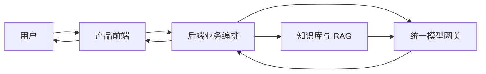
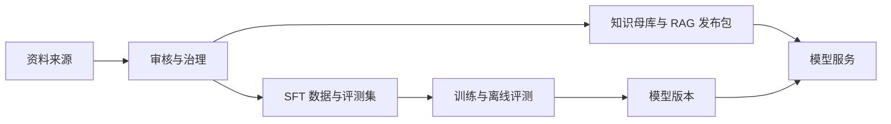

# 群学致知：社会学知识探索与研究设计平台

# 一、产品概览

群学致知是一个由社会学科研推理垂类模型支撑的社会学知识探索与研究设计平台。首期用户是第一次独立开展课程论文、毕业论文或研究设计的本科高年级学生，并兼容处于相同研究阶段的低年级硕士。产品帮助他们从模糊兴趣、社会现象或已有材料出发，发现可能适用的理论，比较理论的成立条件和解释边界，再把用户选定的理论落实为研究框架。

v0 首页提供两个同级主入口：

1. **可视化知识库**：通过七维知识结构、目录、关系和知识详情探索社会学知识，无需先创建研究任务。
2. **SocioMatch**：从已确认的社会现象出发，匹配并比较可审核的理论候选，再把用户选择落实为研究框架。

两个入口共享稳定的知识身份并支持双向跳转，浏览记录、研究任务和理论采用分别保存。SocioMatch 中的“Match”指理论适用性比较：系统说明每个候选能够解释什么、成立需要什么条件、当前材料支持到哪里、还缺什么证据，以及有哪些边界和竞争解释。

用户可以从两个研究阶段进入 SocioMatch：从 0 开始时，智能选题把兴趣整理为若干可观察的现象候选；已有研究线索时，用户可以直接描述现象，也可以从一份访谈稿或初步编码文本中提取候选。用户确认现象后，三种操作方式汇入同一条主流程：

> 确认研究现象 → 发现理论候选 → 比较理论适用性 → 用户选择理论 → 将理论落实为研究框架

理论选择以后，质性、定量和混合研究先复用概念映射与证据要求，再进入各自的研究设计分支。v0 中，定量研究交付分析计划，混合研究交付两个子计划及整合关系。最终产物是一份可编辑、可追溯、能够回到经验材料中检验的研究框架；用户继续完成选题确认、理论选择、论文写作和研究结论。

竞赛要求同时开发并交付学科垂类模型与创新应用。群学致知把两项要求落实在同一套系统中：社会学科研推理垂类模型构成 SocioMatch 的核心推理层，产品平台将模型与可视化知识库、检索增强生成（RAG，即先检索审核知识，再把相关证据提供给模型）、用户确认和研究工作流连接起来，使模型能力进入真实研究任务。模型负责理解研究表述与用户材料，判断证据边界，比较理论候选的适用条件，并审校研究框架中的主张、推断和结论。SocioMatch 是该模型在 v0 中的首个核心应用。

知识库与 RAG 向模型提供经过审核的社会学知识和当前任务证据。模型层在理论候选展示前完成适用性判断，在研究框架确认前完成论证审校；候选判断由基座模型还是 SFT 承担，取决于专项评测；研究框架审校由通过最低可用门槛的 SFT 承担。产品平台将判断结果组织成用户能够比较、修改和追溯的内容。第一轮监督微调（SFT，即用审核样本训练模型完成规定的专业判断任务）聚焦这套研究论证审校与结论校准能力。模型训练、评测通过和真实接入共同构成垂类模型交付，可运行的双入口、研究主流程和可追溯研究框架构成产品交付。具体调用契约、SFT 与 RAG 分工、运行和评测规则见 §5.3 及《模型能力与运行架构 Proposal》；知识与训练数据的生产、审核和发布见《数据与微调架构 Proposal》。

“理论发现是目标用户的第一痛点”目前由指导教师判断、团队观察和外部教学研究提供初步支持，仍需目标用户的真实任务验证。这是本项目当前最重要的产品假设。

---

# 二、为什么社会学需要这样一个系统

## 2.1 社会学研究需要怎样的回答

社会学的答案带有坐标。这里的坐标至少包括研究对象及其时空和制度情境、采用的理论视角与分析层次、依据的材料与证据，以及解释成立的条件和适用范围。它们共同决定一个答案在什么问题上成立，能够支持到什么程度。

在人文社会科学中，事实性问题和解释性问题分别依赖不同坐标。“某地青年的平均初婚年龄是多少”可以通过统计资料核验，但答案仍取决于地区边界、青年定义、统计年份和数据口径；“为什么一些青年推迟结婚”还要求研究者解释行为背后的意义、关系与社会机制。不同理论会选择不同对象和分析层次，因而可能对同一现象给出不同解释。

多种答案并不意味着任何解释都能成立。仍以“青年推迟结婚”为例，研究者至少可以提出三条不同的候选解释：

| 候选解释 | 主要关注 | 至少需要核对的证据 |
| --- | --- | --- |
| 个体化视角 | 青年是否把婚姻时间视为个人生活规划和自主选择 | 价值观访谈、人生规划、主动推迟的理由及实际选择空间 |
| 经济与制度视角 | 就业、住房、育儿成本和公共服务是否提高进入婚姻的门槛 | 收入与就业稳定性、住房负担、育儿成本及地区制度差异 |
| 性别关系视角 | 对家务、照护和职业牺牲的预期是否影响婚姻意愿 | 性别角色期待、伴侣协商、家庭分工经验及不同群体比较 |

“推迟结婚”可以同时对应这三条解释，每条解释的成立都需要相应证据。对个人生活规划与自主选择的表达能够支持个体化视角；住房压力需要收入、居住和家庭资源等材料；单一城市中的特定青年样本只能支持相应范围内的判断。这些解释可以相互竞争，也可能分别解释现象的不同部分。三种解释的差异同时体现在理论出发点、研究对象、分析层次、材料要求和适用范围上。

要比较这些解释，研究者还需要说明概念在当前研究中具体指什么，哪些材料构成支持或冲突证据，哪些成立条件尚未满足，以及结论能够延伸到哪里。坐标是判断答案能否成立的组成部分，也是“个体化”“经济压力”和“性别关系”能够进入有依据的比较的前提。

一个听起来合理的解释或一组相关理论，可以帮助研究者打开思路。缺少上述坐标时，这类回答对当前研究主要起到知识联想作用；来源核对、适用性比较、取舍记录，以及向材料收集和研究设计的转换，仍需研究者补足并作出判断。

这些坐标会随着材料补充、理论取舍和研究问题修改持续变化。一次判断所依据的来源、当时的证据状态、采用或排除理由和框架版本，需要被后续步骤继承；出现新材料或新问题时，还要能够返回原来的依据重新检查。要通过产品稳定支持这项工作，系统需要承载连续研究状态，把分散在知识检索、材料判断和方法设计中的信息放回同一项研究，使比较、决定和修订能够前后衔接。

群学致知据此把理论发现组织为一套带坐标的候选比较。系统围绕同一现象呈现多个可比较、可追溯的理论候选，分别说明它解释什么、依赖什么条件、当前材料支持到什么程度、还缺少哪些证据，以及存在哪些竞争解释。用户据此采用、排除、保留或组合理论，系统再将取舍结果转化为下一步材料要求和研究设计。

## 2.2 现有工具已经解决什么，还缺什么

社会学研究训练要求研究者把理论、方法和证据放在同一项研究中，评价理论能否用于具体问题，并形成有依据、有限定范围的论证。[英国 QAA 2026 年社会学学科基准](https://www.qaa.ac.uk/the-quality-code/subject-benchmark-statements/subject-benchmark-statement--sociology)把理论与方法的应用和评价、基于证据的论证列为学生应形成的能力，并把生成式 AI 作为当代学科环境的一部分。完成一项研究通常需要跨越知识获取、研究设计、资料收集和分析等环节。第三章界定本项目待验证的目标用户、研究任务和证据缺口，第七章再通过真实任务确认他们实际怎样组合工具。因此，本项目按工具在研究任务中的作用和替代关系比较竞品，并把 AI 视为横跨各类工具的能力。

| 工具类别 | 代表性产品或做法 | 已经解决的环节 | 与群学致知的关系 |
| --- | --- | --- | --- |
| 通用 AI | ChatGPT、Claude、DeepSeek、Kimi | 讨论选题、联想理论、概括材料并提出研究设计建议 | 在普通对话使用方式下，用户仍需自行核对来源、判断理论是否适用，并把各轮讨论整理为连续的研究方案 |
| 学术检索与研究 AI | 知网、Web of Science、Google Scholar、Litmaps、[Elicit](https://elicit.com/)、[Consensus Research Agent](https://help.consensus.app/en/articles/12641232-research-agent) | 发现文献、呈现引文关系、比较论文、提取证据并形成带引用的综述 | 主要产品对象是文献和既有研究证据；用户自己的社会现象或经验材料如何进入理论适用性判断，仍需继续完成 |
| 专业研究软件 | NVivo、MAXQDA、ATLAS.ti、Dedoose、Qualtrics、SPSS、Stata、R | 收集问卷，组织和编码材料，编写备忘录，查询资料并完成统计分析；部分产品已经加入 AI 编码、代码建议和材料问答 | 核心对象是研究材料与分析操作；跨文献发现并审校多个既有社会学理论候选并非其核心定位，最终理论判断仍由研究者完成（参见 [QDA 软件比较](https://merit.education.wisc.edu/qualitative-software-support/choosing-a-qda-package/)与 [MAXQDA AI Assist](https://www.maxqda.com/products/ai-assist)） |
| 研究方法与框架生成产品 | [SAGE Research Methods](https://learningresources.sagepub.com/research-methods)、[SAGE Research Methods AI Tutor](https://researchmethodscommunity.sagepub.com/blog/sage-research-methods-ai-tutor)（2025 年公开招募首轮测试）、[LogicWeaver](https://logicweaver.org/)、[维谷AI](https://www.3dgu.com/) | 提供方法学习与项目规划，连接理论、方法和证据，生成研究框架、文献综述或科研写作产物 | 这是与群学致知最接近的一组产品；其公开定位覆盖通用研究方法支持和学术产物生成，尚未明确呈现面向社会学既有理论的多候选适用性比较与持续决策状态 |
| 人工与组合工作流 | 导师、课程、教材，加上上述一项或多项工具 | 提供情境化指导，并按具体研究灵活调整理论、方法和材料 | 这是重要的现实替代方式；信息、理论取舍、证据边界和阶段产物主要由研究者自行串联 |

截至 2026 年 8 月 3 日，上述公开资料表明，近邻产品已经深入研究规划、理论—方法—证据对齐和框架生成；公开资料尚未明确显示有成熟产品一体化覆盖 §2.4 所述的社会学研究判断链。群学致知据此把现有工具组合视为竞争环境，把产品切入点放在这条判断链的连接与状态保留上。第三章据此界定待验证的目标用户与任务；第七章验证产品相对人工独立完成和通用 AI 辅助的增益，近邻产品的直接效果差异留待专项竞品对照。

## 2.3 为什么系统需要社会学专业判断能力

带坐标的研究判断同时包含可确定的管理任务和开放的语义任务。知识库与 RAG 提供经过审核的理论、来源和当前证据，确定性规则校验知识身份、审核状态、引用范围和用户确认；它们分别回答依据从哪里来、流程能否进入下一步。理论是否真正回应当前现象、分析层次是否一致、现有材料支持到什么程度、结论是否越界，还需要结合用户的自然语言材料、理论语境和具体研究方法作出判断。

这类判断难以由关键词相似度或预先枚举的规则稳定覆盖。同一个词语可能指向不同概念，表面不同的现象也可能具有相近机制；质性、定量和混合研究对材料、推断和结论的要求同样不同。系统因此需要一种能够还原研究问题、概念、对象、方法、证据、推断与结论关系的模型能力，用它比较理论候选的适用性，形成条件式判断，并识别证据缺口、解释边界和竞争解释。

群学致知把这项能力建设为可训练、可评测、可版本化并真实接入产品的社会学科研推理垂类模型。它的垂类性由社会学理论语境、分析层次、方法差异和证据边界共同定义，语言风格不作为专业能力证据。知识事实继续由知识库和 RAG 提供，垂类模型结合材料和方法作出专业判断，产品平台保存来源、状态和过程，用户作出理论选择并负责最终研究结论。未经本项目监督微调的基座模型是必须比较的实现基线；第一轮 SFT 聚焦校准模型使用材料和证据的方式，只有在同输入、同证据和同设置的对照中形成稳定增益，项目才声明相应的 SFT 优势。

## 2.4 群学致知要形成的研究判断链

群学致知把上述产品假设组织为一条由知识、模型和用户共同完成的判断链：

| 研究环节 | 产品要形成的能力 | 主要支撑 |
| --- | --- | --- |
| 召回理论与证据 | 从已审核知识中召回多个理论及相关证据，与当前任务材料一起装配并保留来源 | 知识库与 RAG |
| 核对判断依据 | 区分文献事实、材料中可核验的陈述和系统推断，保留来源与审核状态 | 证据状态与垂类模型 |
| 比较适用性 | 判断哪些召回理论能够进入可比较候选，并说明其成立条件、分析层次、证据缺口、解释边界和竞争解释 | 社会学科研推理垂类模型 |
| 完成用户裁决 | 支持采用、排除、修改或组合理论，并记录理由 | 产品交互与用户确认 |
| 落实并审校研究 | 把理论选择落实到研究问题、概念映射、材料要求、证据约束和替代解释 | 研究工作流与垂类模型 |
| 标记不确定性 | 对知识未审核、材料不足或竞争解释尚未排除的情况保留状态标记 | 证据状态、垂类模型与产品界面 |

完整能力需要知识组织、证据状态、模型判断、用户裁决和研究落实同时成立。固定四段式概念史、概念考古和语料体量可以服务内容组织，产品验收以整条判断链为准。

## 2.5 研究起点的检索边界

这条判断链首先需要跨过一个检索边界：当用户能够描述研究场景，却说不出理论或概念名称时，系统能否从审核知识中定位正确方向。2026 年 7 月 10 日，项目使用中文向量模型 bge-small-zh-v1.5 对知识库真实原文做了一次小规模边界实验。语料包含 10 个文本块，其中有“场域”的四段正文和 6 个干扰块；三个干扰块也出现“场域”二字，用于模拟知识库中的交叉污染。4 个查询分为两种表达方式。

| 提问方式 | 检索结果 |
| --- | --- |
| 说得出概念名（“什么是场域”“布迪厄如何定义场域”等三个） | 三个查询的正确条目均排第一，第一名相似度 0.695—0.787；其中“什么是场域”查询的四个场域块包揽前四 |
| 只描述研究场景（“我研究外卖平台上骑手之间的竞争，该用什么概念框架”） | 正确条目 0.477，仍排第一；与无关的交换网络条目 0.460 相差 0.017，区分度很低 |

实验给出两项直接结果。能够说出概念名时，三个查询的正确条目均排第一；只描述研究场景时，正确条目仍排第一，但与无关条目的差距缩小到 0.017。这次结果提示，场景式输入不能只依赖一次向量排序；知识类型、结构位置、理论档案和重排策略能否提高稳定性，还需在更大语料、更多概念和更多场景上检验。实验规模只有一个小模型、10 个文本块且未使用重排器，因此它用于定位产品边界，不用于证明完整 RAG 效果。

脚本、原始结果与复现命令见《数据/RAG 边界实验》。

---

# 三、用户、任务与证据状态

## 3.1 首期用户与研究阶段

首期核心用户是第一次独立完成社会学课程论文、毕业论文或研究设计的本科高年级学生。低年级硕士作为兼容用户，复用同一条工作流。

这类用户通常已经学习过基础社会学概念和研究方法，当前任务是运用既有理论理解经验现象。他们的材料准备程度不同，但共同缺口是理论知识覆盖有限，也缺少判断 AI 专业输出是否可靠的稳定标准。

| 阶段 | 用户状态 | 本期服务方式 |
| --- | --- | --- |
| 0 | 没有明确现象，只有兴趣方向或对社会生活的模糊关注 | 通过智能选题形成多个现象候选 |
| 从研究线索切入 | 已有模糊现象、社会观察、初步研究问题、访谈稿或初步编码材料，尚无稳定理论框架 | 直接输入并澄清现象，或从一份文字材料中提取现象候选 |
| 更后阶段 | 已形成完整分析、研究设计或报告 | 抽取其中的具体现象进入主流程；整篇文档审查留在 P1 |

产品的默认用户时刻位于“从研究线索切入”阶段：

> 用户已经意识到某件社会生活中的事情值得研究，但还没有形成稳定的正式研究问题和理论框架。

选择这一默认时刻，是因为理论判断此时仍能改变研究方向，用户也已经具备最低限度的现实指向。兴趣方向和已有材料都可以先形成现象候选，再汇入这一节点。

用户可以从兴趣方向、现象、问题或材料片段开始。已有完整报告的用户也从其中一个具体现象进入 SocioMatch。

## 3.2 用户面对的任务

目标用户通常带着模糊兴趣、社会现象或一两次访谈进入研究。他需要连续完成几次判断：

1. 眼前的材料中究竟有什么值得研究的现象？
2. 哪些社会学理论可能解释这个现象？
3. 各理论分别解释什么，建立在什么前提上？
4. 哪个理论适合当前研究，哪些理论应当排除或保留为竞争解释？
5. 选定理论后，接下来应当收集什么材料，如何调整研究问题？

现有工具可以给出若干理论名称，用户仍需核对学科归属、来源、成立条件和适用边界。项目处理的是一条连续任务链：

`知识面有限`

→ 理论候选范围较窄\
→ 候选主要来自熟悉概念或通用 AI 的即时联想\
→ 适用条件和分析层次不清\
→ 比较、排除和组合缺少依据\
→ 理论与访谈、观察、编码脱节\
→ 理论名称停留在材料表面，尚未形成可检验的研究解释

“理论匹配”是链条中的核心引擎动作，产品交付包括：

- 扩展候选范围；
- 显示推荐依据；
- 呈现适用边界；
- 支持理论比较；
- 由用户完成关键判断；
- 将判断继续落实到经验研究。

本项目的核心问题是：

> 如何让理论知识有限的社会学研究者，从模糊兴趣、经验现象或已有材料出发，发现并比较可能适用的理论，在保留判断权的前提下形成可执行、可追溯、能够被经验材料支持或反驳的研究框架？

## 3.3 核心用户任务

> 当我注意到一个值得研究的社会现象，或在访谈材料中发现一些反复出现的线索，却不知道有哪些理论可能相关时，我希望看到一组有来源、有适用条件、能够互相比较的候选，并在理解差异后自己作出选择，再把选择落实为下一步可执行的研究安排。

## 3.4 证据状态

当前方向已有指导教师判断、团队观察、社会科学论证研究和社会学教学研究作为初步支持。团队已有知识库、旧多智能体代码和社会学专业支持，可以制作垂直样例并开展专家审核。

这些外部研究提供了几条待验证的教学线索：初学者容易机械套用概念、过度概括材料、忽略多重解释，也常说不清理论之间的关系或结论所需的证据；把理论重新放回真实观察和研究活动，有助于连接理论、经验与方法。本项目据此提出验证问题，目标用户研究负责确认这些线索是否适用于群学致知。

现阶段仍有四个关键缺口：

1. 学生研究困难还可能集中在选题、资料获取、访谈执行、编码、方法和写作，理论发现作为第一痛点仍待目标用户验证。
2. 当前直接证据主要来自指导教师和团队内部讨论，真实任务记录尚未形成。
3. 通用 AI 已能完成基础“现象—理论”联想，产品差异需要在候选质量、边界、用户判断和研究落实上通过对照证明。
4. 项目仍需建立经过社会学专业人员审核的“现象—理论—研究框架”基准案例。

2026 年 7 月 25 日的方法范围证据审计显示，本项目目前缺少目标用户对变量、假设、测量、统计或混合研究支持需求的一手记录。相邻人群研究中，一项对 373 名国内社会工作专业大四学生的调查报告质性、量化和混合研究分别占 26.27%、19.57% 和 34.59%，并将资料分析、资料收集、问卷或量表设计列为高频困难。该研究的专业范围、目的抽样和滚雪球抽样限制了外推；英国社会科学教学研究与中国社会学学生之间也存在人群差异。因此，这些外部材料用于形成验证假设，教师与团队判断作为补充依据。

研究方法范围采用当前已确认口径：质性、定量和混合研究都覆盖到“理论如何落到研究设计”。质性研究增加单份访谈稿或初步编码文本入口；定量研究交付研究设计与测量建议；混合研究交付方法顺序、权重和整合点。三类方法的完整执行工具属于后续范围。

材料提炼形成描述性的现象线索，并保留原文依据和单份材料的适用范围。系统分别记录来源可追溯状态、陈述性质、用户采纳状态和证据支持状态；用户确认只改变采纳状态，来源与证据状态保持独立。

这些判断是当前产品决策。目标用户验证与效果实验按《核心需求与效果验证方案》执行，结果可以触发下一版 Proposal。

---

# 四、产品体验与边界

## 4.1 首页与双入口

首页先说明“从社会现象找到可比较理论，再形成研究框架”的产品价值，并提供两个同级、直接可达的入口：可视化知识库和 SocioMatch。Live Demo 使用真实产品状态或明确标识的演示数据；动态展示同时提供静态内容和减少动态效果的版本。

两个入口以稳定知识 ID 双向连接：

- 从 SocioMatch 候选打开知识详情，核对理论含义、来源、边界和相关概念，再返回原研究任务；
- 从理论详情发起 SocioMatch，系统把该理论记为起始线索，后续仍经过现象确认、候选比较和理论采用。

知识浏览记录、研究任务状态和理论采用状态分别保存。浏览行为只更新浏览记录；从理论详情发起任务时，该理论保持起始线索身份，采用状态由用户另行决定。

## 4.2 可视化知识库

可视化知识库服务无需建立研究任务的知识探索。用户可以按目录浏览或用关键词定位；选中条目后，同屏查看正文、结构位置、来源、审核状态和已经审核的显式关系。图形视图不可用时，系统保留结构路径、目录树、关系列表和版本化静态内容。

v0 以七维知识体系作为上层知识目录，分别回答社会世界如何构成、行动与实践如何发生、研究如何开展、价值立场如何处理、知识如何成立、理论传统如何分化，以及学科如何演进：

| 编号 | 维度 |
| --- | --- |
| D1 | 本体论 |
| D2 | 实践论 |
| D3 | 方法论 |
| D4 | 价值论 |
| D5 | 认识论 |
| D6 | 学派传统 |
| D7 | 学科史 |

当前活知识库的发布基线为 901 条记录：464 条理论或概念、239 条研究方法、141 条研究操作、57 条认识论条目。每条记录以稳定 `knowledge_id` 连接知识类型、所属维度、正文、来源、审核状态和内容版本。901 条全部进入基础人工审核；首批核心理论完成深度审核并形成 `TheoryProfile` 后，取得 SocioMatch 正式候选资格。

七维源文件是上游扩充资产，其中 D1—D6 共 2791 条、D7 学科史 91 条。它们与当前 901 条使用不同统计口径，经过映射、去重和审核后再逐批进入发布母库。完整数据结构、审核和用途准入见《数据与微调架构 Proposal》。

## 4.3 SocioMatch 与理论候选卡

SocioMatch 负责从审核知识库和 RAG 召回理论及证据，再围绕用户确认的现象判断候选的适用性。关键词和向量相似度用于召回与排序；候选比较依据理论的问题意识、分析层次、成立条件、当前证据和解释边界。

理论候选卡按四组信息组织：

| 信息组 | 展示内容 |
| --- | --- |
| 身份与来源 | 理论名称、社会学分支或传统、文献来源、知识版本和审核状态 |
| 理论主张 | 核心问题意识、概念关系或命题，实际解释对象，适用条件与理论承诺，分析层次 |
| 当前判断 | `applicable / conditional / insufficient / not_applicable`，匹配理由，支持、冲突或不足的材料线索，待补材料 |
| 边界与比较 | 局限、常见误用、当前无法解释的部分、竞争或互补理论 |

候选数量由专业门槛决定。用户可以采用、排除、保留、组合或暂缓，并记录理由；采用多个理论时，还需说明互补、分层或竞争关系、解释分工和各自所需证据。理论排序、候选身份和用户采用分别记录。

## 4.4 研究框架与方法分支

理论方案确认后，系统生成结构化研究框架，至少包含：

- 用户确认的研究现象、对象、语境和未确定信息；
- 原始研究问题、建议版本、确认版本和调整理由；
- 理论采用、排除或保留记录，以及多理论关系与分工；
- 关键概念在当前研究中的具体指向；
- 已有材料、待补材料、证据约束和竞争解释；
- 伦理与可行性要求、适用边界和下一步行动。

质性、定量和混合研究共享上述主干，再形成不同 `MethodPlan`。质性分支接收一份访谈稿或初步编码文本并形成资料收集、分析与反思安排；定量分支形成概念操作化、测量、抽样和分析计划；混合分支形成两个子计划及其顺序、权重和整合点。v0 的终点是研究设计，详细边界见《Demo 与应用架构 Proposal》§3.6。

## 4.5 成功标准与伦理边界

产品成功由四项结果共同判断：

- **专业相关性**：候选与用户现象和研究目的相关，并呈现真实的解释差异；
- **来源可核验性**：知识、文献、材料陈述和系统推断具有清晰来源；
- **用户判断**：用户理解候选差异，能够说明采用、排除、保留或组合的理由；
- **研究可执行性**：理论选择落实为材料、证据约束、替代解释和下一步行动。

理论名称数量、回答流畅度、图谱复杂度、计划篇幅、演示效果和旧功能数量用于描述呈现规模；产品成效由真实任务、专业审核、用户决策和可恢复链路判断。

系统提供候选、证据、比较和研究操作建议；用户确认现象、选择理论、调整研究问题并形成研究结论。产品输出止于研究框架，AI 参与、材料来源和系统推断在界面与导出中保持可识别。来源状态、陈述性质、用户采纳和证据支持按 §3.4 分别记录。用户确认记录知情选择和研究责任，系统继续负责来源核验、适用边界、错误提示和可理解解释。

学校或机构的伦理审查、研究参与者知情同意和研究者的数据使用责任继续适用。用户上传材料前，应完成必要脱敏并确认处理权限。系统不得虚构、改写或补全访谈引语、观察记录、研究数据和编码依据；用户原始材料默认不进入训练，Q11 关闭前不启用长期留存。第三方模型调用披露材料外发范围、保存期限和删除方式，AI 辅助使用遵守课程、学校或研究机构的披露要求。

## 4.6 付费方与规模化假设

当前付费关系有三条待验证路径：院系、研究方法课程和高校图书馆作为主要机构付费方，学生个人付费作为补充；研究团队为知识库、项目管理与协作能力付费；社会学完成实证后，再为其他解释性学科重做语料生产和专家审校。验证分别回答谁使用、谁受益、谁拥有预算，以及群学致知相对通用 AI 提供了什么值得付费的价值，安排见 §7.2。

---

# 五、产品、知识与模型架构

## 5.1 产品运行与离线生产

产品运行时经过同一条后端业务链：

前端通过业务 API 提交任务和用户决定。后端负责研究状态、检索装配、模型调用、规则校验、来源记录和失败恢复；模型服务位于统一网关之后。详细状态机、领域对象和页面流程由《Demo 与应用架构 Proposal》维护。

离线生产负责把资料转化为可发布知识、训练数据和模型版本：

知识与数据组、模型训练组、Demo 与工程组分别形成工作流；RAG、端到端集成和独立评测责任人在《决策与责任台账》中认领。

## 5.2 知识母库与用途准入

带稳定身份、来源、审核和版本的知识母库是产品事实源。浏览数据、RAG 语料、训练案例证据候选和理论档案从同一母库派生：

| 对象 | 作用 |
| --- | --- |
| `KnowledgeEntry` | 保存知识正文、类型、所属维度、稳定 ID、内容版本和审核状态 |
| `SourceRecord` | 保存作者或机构、题名、出版信息、定位、核验状态和使用边界 |
| `KnowledgeRelation` | 保存有方向、有类型、有依据并经过审核的显式关系 |
| `TheoryProfile` | 为首批核心理论补齐命题、机制、解释对象、适用前提、分析层次、经验指征、排除信号、误用、边界、竞争理论和字段级证据 |
| `ReviewRecord` | 保存审核对象、审核人、结论、修改说明和审核版本 |
| `ReleaseManifest` | 冻结发布版本、对象清单、数据哈希、审核范围和派生产物 |

每条记录分别判断浏览、RAG、训练候选和正式匹配资格。图谱学术关系、证据等级、工程权重和查询时向量相似度分别记录；向量分数表示检索相似性，理论适用性由候选判断完成。图查询读取已经发布并审核的显式关系。

## 5.3 垂类模型如何进入产品

完整竞赛 v0 同时交付可运行的群学致知平台和经过训练、评测并真实接入产品的社会学科研推理垂类模型。第一轮 SFT 训练一项可复用的基础能力：还原研究问题、概念、对象、方法、证据、推断与结论之间的关系，按照具体研究方法识别论证断裂，并把结论校准到现有证据能够支持的范围。知识事实由知识母库和 RAG 装配，SFT 校准模型使用材料和证据的方式。

这项能力进入两个真实产品节点：

| 调用 | 产品位置 | 输出与状态影响 |
| --- | --- | --- |
| `judge_theory_candidate_v1` | RAG 召回以后、候选展示以前 | 形成 `applicable / conditional / insufficient / not_applicable` 判断，返回支持证据、冲突证据、成立条件、证据缺口和解释边界 |
| `audit_research_framework_v1` | 研究框架草稿生成以后、用户最终确认以前 | 返回主张审校、推断断裂、缺失证据、替代解释和校准建议；严重断裂使框架保持草稿态，用户修订后重新审校，或带理由显式覆盖并保留未解决标记 |

Mock、基座模型和 SFT 模型遵守同一结构化接口，支持并行开发、同条件对照和故障恢复。系统记录每次调用的 provider、基座或 SFT 身份、模型版本、输入证据、输出和降级状态，并在界面与日志中显示实际能力层级。

SFT 的交付接入与优势声明分别验收。通过最低可用门槛的 SFT 按竞赛要求接入研究框架审校；§7.3 的同条件对照进一步检查证据不足、无依据补造、方法范式误伤和结论越界，并决定项目能够声明的相对增益。

完整竞赛版本由通过最低可用门槛的 SFT 接管 `audit_research_framework_v1`。`judge_theory_candidate_v1` 在理论适用性专项评测通过后由 SFT 接管，评测期间使用真实且明确标识的基座调用。对照结果决定项目能够声明的 SFT 增益，训练版本、评测记录和真实接入共同构成垂类模型交付证据。模型契约、技术来源、社会学方法漏洞清单、评分维度和门槛见《模型能力与运行架构 Proposal》。

## 5.4 三种完成状态

| 完成状态 | 成立条件 | 主要证据 |
| --- | --- | --- |
| 数据发布完成 | 知识、关系、RAG 语料、训练与评测数据通过各自审核和版本冻结 | `ReviewRecord`、`ReleaseManifest`、数据卡和切分记录 |
| 模型训练完成 | 形成可复现模型版本并完成隔离离线评测 | 训练配置、日志、模型版本和评测报告 |
| 产品接入完成 | 真实调用在指定节点产生结构化输出并按契约改变产品状态 | provider 记录、调用追踪、状态变化和端到端验收 |

里程碑分别验收这三种状态，每种状态都按本表所列证据独立成立。

## 5.5 文档分工

| 文档 | 唯一维护内容 |
| --- | --- |
| 本总 Proposal | 用户问题、产品体验、完整 v0 范围、总验证与验收 |
| 《Demo 与应用架构 Proposal》 | 页面流程、领域对象、业务接口、状态机和失败恢复 |
| 《模型能力与运行架构 Proposal》 | 模型职责、调用契约、SFT/RAG 分工、降级和评测门槛 |
| 《数据与微调架构 Proposal》 | 知识母库、数据生产、人工审核、用途准入、切分和发布 |

---

# 六、v0 范围与边界

完整竞赛 v0 同时交付可运行的产品平台与真实接入产品的社会学科研推理垂类模型。本章冻结总体范围；31 项 P0 的原定义和验收重点由《决策与责任台账》作为详细范围与验收清单维护。近期纵向切片只决定实施顺序，不缩减完整 v0；页面与状态、业务接口、失败恢复、实施和验收分别见《Demo 与应用架构 Proposal》§2—§5、§7—§10。

## 6.1 完整 v0 范围

| 组成 | v0 范围 | 核心边界 |
| --- | --- | --- |
| 产品与可视化知识库 | 首页提供可独立到达的可视化知识库与 SocioMatch 两个平级入口。知识库支持目录浏览、关键词定位、详情、结构位置、来源、审核与发布状态及显式关系；用户可以从理论档案发起 SocioMatch，也可以从理论候选返回知识详情，两个方向通过稳定 ID 互通。竞赛发布覆盖 901 条经人工审核的活知识记录；正式关系、RAG 语料、训练数据和候选依据分别通过相应人工审核与用途准入。联网学术检索在本地覆盖不足时补充分层、可追溯的库外线索。 | 结构导航关系不冒充学术关系；预览内容显示审核状态，待核验内容不进入正式发布；库外结果不自动入库，联网失败不阻断本地主链；演示媒体失效时，两个真实入口和静态内容仍可使用。 |
| SocioMatch | 智能选题、直接描述现象、单份访谈稿或初步编码文本进入同一种研究任务，并在用户确认现象后汇入理论候选、适用性比较、用户决定和研究框架主链。正式候选可以有多个、一个或零个，分别呈现依据、成立条件、解释边界和材料要求；用户可以采用、排除、保留、组合或暂缓理论。研究框架继续形成概念映射、材料要求、证据约束、替代解释、适用边界和下一步行动，并进入质性、定量或混合研究的 `MethodPlan`；混合研究同时说明两类方法的关系与整合点。 | 未确认现象不能进入正式匹配，用户未选择理论不能生成正式研究框架；库外探索候选与正式候选分层，Q06 关闭前不能正式采用；多理论方案必须说明关系和分工；材料、来源、系统推断和用户决定全程留痕，访谈原文默认不长期保存或用于训练。 |
| 社会学科研推理垂类模型 | 使用审核数据完成一次可复现的 SFT，在隔离测试集上与基座、专业指令和少样本方案进行同条件对照，并把通过门槛的模型版本接入 §5.3 规定的真实产品调用。 | 最低可用门槛决定研究框架审校的 SFT 接入，相对增益决定项目能够声明的 SFT 优势；理论候选判断是否由 SFT 接管另由专项评测决定。每次调用保存实际模型身份、版本、输入证据、输出和降级状态。 |

完整 v0 的总体范围由本章决定，P0 详细清单保存实施分解和验收定义。范围发生变化时，先修改本章，再同步台账和受影响的子 Proposal。

## 6.2 P1

P1 包括多份访谈横向比较、跨受访者主题归纳、音视频转写、OCR、更完整的 SocioCode、完整报告一致性审查、SocioWrite、SocioTeach、团队协作和长期研究资产管理。SocioMatch 对当前研究框架的审校仍属于 v0；P1 的完整报告审查聚焦研究问题、理论、方法、材料、推断和结论之间的可追溯一致性。通用语法润色、查重、整篇改写、数据真实性判断和论文质量裁决不进入这一长期能力。

## 6.3 明确不做

v0 不提供以下能力：

- 一键生成完整论文或自动作出最终研究结论；
- 从经验材料中自动生成或宣称新的社会学理论；
- 提供完整扎根理论研究流程，或向资深研究者承诺原创理论创新；
- 把历史 Agent 平铺成首页主功能；
- 在训练任务契约、输出规范和少量金标准样例验证前批量生产训练数据；
- 为展示技术复杂度引入尚未证明净增益的多 Agent 或自创理论体系；
- 用预制 Demo 的顺利运行代替真实任务中的用户价值验证。

---

# 七、验证与验收

## 7.1 完整竞赛 v0 硬门槛

以下项目不需要等待基线，可以直接设为硬门槛：

1. 两个方向、三种操作方式都能抵达同一现象确认节点。
2. 未确认现象无法启动正式匹配。
3. 所有访谈原文引句可返回来源位置。
4. 所有正式文献引用真实存在，伪造数量为零。
5. 在首批理论库明确覆盖且多个候选均达到门槛的基准案例中，返回具有解释差异的正式理论候选；可靠候选只有一个时不为凑数补足，真实输入超出覆盖范围时明确显示无可靠正式候选，通用模型探索候选另行分层展示。
6. 候选包含适用前提、边界、材料要求和来源。
7. 采用多个理论时，方案必须记录关系、分工和证据。
8. 用户未选择理论时无法生成正式研究框架。
9. 研究框架包含经验材料、证据约束、替代解释与适用边界；存在清晰可检验命题时再包含潜在反证。
10. 产品不生成完整论文。
11. 用户访谈原文默认不用于训练或长期留存。
12. 干净环境可以按 README 启动前后端并完成演示。
13. 《决策与责任台账》中的 P0-T01—P0-T03 全部通过，§5.4 的数据发布、模型训练和产品接入均具有独立证据。
14. 每个进入 v0 的功能都要通过范围检查：三十秒讲不清用途，或者社会学研究生看完说不出“我下周就想用”，就不进 v0，转入以后版本。

### 竞赛评分对应

| 竞赛关注点 | 群学致知提供的证据 |
| --- | --- |
| 完成度 | 一条可运行、可恢复的真实纵向链路，不用页面数量代替闭环 |
| 创意与实用 | 将理论推荐转化为可比较、可追溯并由用户裁决的研究过程 |
| 技术实现 | 可复现 SFT、真实检索、来源装配、状态通过条件和研究框架生成 |
| 技术先进性 | 用模型对照、RAG 消融和真实工作流验证专业约束，不用未经验证的复杂架构包装 |
| 内容质量 | 理论条目、文献、关系和案例经过社会学专业审核 |
| 用户认可 | 用户使用自己的现象或材料完成任务，不以预制 Demo 代替 |
| 商业化潜力 | 先验证使用者、受益者和付费方，不虚构已有收入模型 |

## 7.2 核心需求验证

本轮需要检验八项可以被证据否定的假设：

| 假设 | 否证信号 |
| --- | --- |
| H1：目标用户存在稳定的理论发现困难 | 多数用户能独立形成充分候选，困难主要位于其他环节 |
| H2：候选比较能提升理论判断 | 用户只选择首项，无法说明采用和排除理由 |
| H3：理论可以落实为可执行研究框架 | 输出仍停留在理论介绍，无法指导下一步研究 |
| H4：两个方向和三种操作方式能够复用同一主链 | 某入口长期无法形成可确认现象，或需要维护两套后续逻辑 |
| H5：小规模审核库足以验证产品价值 | 覆盖过小，使多数真实输入没有可用候选 |
| H6：来源、边界、证据约束和替代解释能提高可信度 | 这些字段仍不能帮助识别误配，或明显增加理解负担 |
| H7：目标用户需要不止一种研究方法路径 | 非质性需求只停留在抽象偏好，或主要发生在核心链路之外 |
| H8：SFT 能改善可迁移的专业判断，而不只是文风 | 提升只出现在同模板案例，专业判断无改善或通用能力明显下降 |

H6 单独采用盲审对照验证：对同一批案例准备两组内容等价的输出，一组完整呈现来源、适用边界、证据约束和替代解释，另一组不呈现这些字段；由不知道分组条件的社会学专业人员比较误配识别、结论越界和可追溯性，同时记录目标用户理解这些字段所增加的负担。只有专业判断改善且理解成本可接受，才支持 H6。

第一轮让用户带真实问题完成任务，界面偏好作为补充记录：

1. 记录用户原先能想到的理论；
2. 让用户使用通用 AI 完成一次相同任务；
3. 让用户使用群学致知完成候选比较；
4. 记录用户新发现了什么理论；
5. 让用户口头说明采用、排除和保留的理由；
6. 让用户依据研究框架修改一个研究问题，或完成与其实际方法一致的下一步研究设计产物；
7. 由社会学专业人员审核候选、理由和研究建议；
8. 一段时间后用相似案例测试用户能否迁移判断。

这样才能区分“系统替用户答得更好”和“用户真的获得了判断能力”。

首轮至少记录：

- 真实研究任务、课程或论文阶段；
- 用户原有的理论搜索与判断方式；
- 困难实际发生在哪一步；
- 用户当前必须完成的下一步产物；
- 通用 AI 与群学致知的同任务结果；
- 用户采用、排除或修改候选的理由；
- 社会学专业人员复核；
- 失败案例和对范围的影响。

工具尚未成熟时，验证按四个阶段推进：先用真实任务访谈追溯用户原有过程，再用经过人工审核的固定案例和纸面原型验证问题与范围；主链完成后进入主持式可运行原型，产品稳定后再让此前未接触方案的用户独立测试。方法纸面原型围绕同一研究现象并列展示经过专业审核的质性、定量和混合研究后续框架，让用户批改、拒绝或排序，并结合自己的真实任务说明理由。首轮采用目的抽样，结果适用于被覆盖的用户与任务范围；样本逐步覆盖本科高年级和低年级硕士、课程论文和毕业论文等不同任务、不同方法倾向，以及有无材料的研究阶段。单一学校或课程的结果须标明适用边界。

方法需求根据真实任务、用户下一步必须完成的产物、现有困难和一次实际操作综合判断。功能偏好只作为补充信息。范围复核同时考虑各类任务出现频率、困难强度、与“理论落实为研究设计”主链的接近程度、首期实现成本和专业审核成本，并按以下规则调整：

| 复核结果 | 证据表现 | 范围变化 |
| --- | --- | --- |
| 收缩 | 非质性任务极少，或用户不需要本产品协助研究设计 | 对应分支只做识别和诚实退出 |
| 保留 | 三类任务均出现，困难集中在理论操作化和研究设计 | 保留质性设计、定量轻设计和混合整合边界 |
| 扩展 | 用户反复需要数据处理或统计执行，且专业与技术审核证明可控 | 另立 Proposal，不由当前 v0 自动扩张 |

首次使用、材料提炼和理论专业性分别复核。首次使用要检查三种入口能否形成用户自己的可确认现象，内置案例是否掩盖真实输入失败，以及已有现象的用户面对空白输入时能否理解需要填写什么。材料提炼除检查引句位置、上下文回溯、材料外推断、提前植入因果或理论以及单份材料被写成普遍事实外，还要观察材料用户是否愿意上传自己的真实文本、是否会逐项核对现象候选，以及是否认可系统对材料的归纳。社会学专业审核至少检查候选存在性、来源、核心命题、适用前提、关键词误配、候选差异、多理论关系、材料建议以及可能削弱或限制当前解释的证据。

赛题要求至少两名真实用户记录。两名用户对应参赛材料底线；产品有效性还需要更完整的真实任务样本与专业复核。最终报告分别呈现合规用户数量、产品验证样本、社会学专家审核和普通用户可用性测试。

## 7.3 模型价值验证

模型评测使用相同基座、相同解码设置和相同输入，显式关闭平台云端搜索与知识插件后，依次比较：

1. 原始基座模型；
2. 基座模型加系统提示；
3. 基座模型加少样本示例；
4. SFT 模型使用相同系统提示。

进入知识问答和理论匹配以后，再增加 `base + RAG` 与 `SFT + RAG`，并向两组提供相同检索证据。诊断集、开发集和密封最终测试集按来源案例、议题、方法、表达模板和概念或理论族隔离。

评分分别记录证据不足、无依据补造、方法范式误伤和结论越界，语言风格单独盲评。预先冻结的最低可用门槛决定 SFT 能否作为竞赛交付接入研究框架审校；相对基座的同条件对照决定项目能否声明 SFT 优势。理论候选判断只有在专项对照通过后才由 SFT 接管。

完整评分维度、数据切分和通过门槛分别由《模型能力与运行架构 Proposal》与《数据与微调架构 Proposal》拥有。

## 7.4 科研类效果验证报告口径

早期赛题核验记录中的“人机判断一致性对比、任务耗时量化”原先对应 SocioCode 的访谈编码任务。产品转向 SocioMatch 后，当前效果验证改用候选适用性、边界判断和研究框架审校口径，并分别回答三个问题：

| 层次 | 验证问题 | 正式口径 |
| --- | --- | --- |
| 核心需求 | 目标用户是否真的在理论发现、比较和研究落实上遇到困难 | 使用真实研究任务访谈与观察，不用功能偏好代替需求证据 |
| 产品效果 | 群学致知是否比人工独立完成或通用 AI 辅助更稳定地形成可审核的候选比较与研究框架 | 在任务边界、输入材料和时间记录一致的条件下做配对或平衡顺序对照 |
| 模型增益 | 本次 SFT 是否比基座、系统提示和少样本基线改善专业判断 | 使用 §7.3 的同证据、同设置、隔离测试集对照 |

SocioMatch 的“人机一致性”定义为：在固定真实案例上，由未参与系统输出的社会学专业人员独立形成审核基准，再比较系统与审核基准在候选适用性、成立条件、排除理由、证据缺口和研究框架问题上的一致与分歧。准确率以专家审核基准计算，用户接受度作为另一项产品指标。正式报告至少同时呈现总体一致率、各类错误、专家分歧和失败案例；是否使用加权 Kappa 等统计量，须在标签分布和样本量满足前提后决定。

“耗时”从用户开始处理同边界任务计时，到形成一份可交给专家审核的候选比较和研究框架为止；模型响应延迟单独记录。正式报告至少保留三个典型案例、两名可确认身份的真实用户、专业审核、原始输入输出、时间记录和失败案例；数值门槛先跑基线再冻结。具体招募、实验顺序、记录模板和停止规则见《核心需求与效果验证方案》。阶段 B 实验设计冻结前，团队须用当届官方模板确认栏目与证据格式。

基线完成后再冻结的候选指标包括：专家对 Top-K 理论候选的相关性评分、边界说明准确性、用户理论发现增量、用户独立说明取舍理由的比例、从入口到研究框架的完成时间、相似任务迁移效果、相对于通用 AI 的错误率与稳定性，以及智能选题的可研究性和资料可获得性。

## 7.5 50 人推广证据计划

早期赛题核验记录记载“50 人以上推广最高加 10 分”。该项在正式执行前仍须复核当届规则、有效人数定义和证据格式。50 人反映推广广度，§7.2 的深度真实任务验证负责判断产品效果。

有效推广记录至少保存去重后的参与者标识、用户类型、招募渠道、使用时间、产品版本、实际进入的任务、完成状态、结构化反馈和必要的知情同意。只打开页面、只观看演示、重复使用和团队成员是否计入，以官方规则为准。研究方法课程或院系课程在教师、时间窗口和授权确认后进入正式招募渠道。

该计划进入完整竞赛 v0 的 M5，不阻塞当前开发顺序。若官方复核表明它属于硬性要求，再通过正式范围变更将其升级为 M6 通过条件；执行和证据归档方式见《核心需求与效果验证方案》。

---

# 八、里程碑与交付

> 本章只有一份交付目标：完整竞赛 v0。§8.1 是当前前后端的开发顺序，属于完整版内部的执行步骤，不单独验收；§8.2 是完整版的全部里程碑与跨组依赖。

## 8.1 当前开发顺序

| 节点 | 核心结果 | 完成标志 |
| --- | --- | --- |
| 近期第一步：基线与契约就绪 | 归档或删除此前的验证代码，从新骨架开始；冻结核心对象、业务 API、模型接口、状态通过条件与错误码；准备一小批带发布版本的已审核理论和证据 | 旧代码已归档且不再被引用；新骨架在干净仓库可复现启动；前后端使用同一契约；责任与通过条件已在台账认领 |
| 近期第二步：SocioMatch Mock 链路 | 跑通“直接输入—现象确认—理论候选—用户裁决—研究框架—模型审校—用户确认” | 前后端通过正式 API 连接；刷新恢复、无候选、超时、失败和暂缓路径成立 |
| 近期第三步：真实 SocioMatch 切片 | 用真实基座调用和已审核小型知识集替换 Mock | 至少一个非预制输入完成全链路；来源、`knowledge_release_id`、实际 provider 和降级状态可追溯 |
| 近期第四步：知识库最小可用版本与互通 | 跑通知识库浏览、搜索、结构语境、详情以及与 SocioMatch 的双向稳定 ID 互通 | 无需创建任务即可探索；理论可以作为起始线索进入研究，但不会被自动采用；图失败时简化为列表 |
| 近期第五步：两个入口合并检查 | 将两个真实链路放入同一产品入口，完成干净环境启动、错误恢复、静态降级和证据报告骨架 | 两个入口均可真实使用且共享同一发布身份；README 可复现；据此计为 M2 双主入口原型完成 |

近期第一步先完成基线与契约；SocioMatch 的第二、三步和知识库第四步随后并行，第五步完成合并检查。第二步至第五步共同构成 M2 的应用侧交付。模型训练与接入由 M2-T、M3-T 验收，联网检索先完成 M0.5 Spike，正式数据与 RAG 由 M4 验收。

## 8.2 完整竞赛 v0 里程碑

| 里程碑 | 核心工作 | 完成标志 |
| --- | --- | --- |
| M0-A：方法需求预验证 | 用目标用户真实任务验证理论落实后的方法需求 | 形成原始记录、方法需求矩阵和范围建议 |
| M0-B：产品口径冻结 | 关闭用户、来源政策、入口、输出和方法覆盖等核心问题 | 本组 Proposal 进入 Accepted，团队口径一致 |
| M0.5：联网检索 Spike | 用预设问题实测数据源、引用核验、中文覆盖、延迟、成本和降级路径 | 冻结首版提供者组合、调用预算和上线边界；联网关闭时本地主链仍可运行 |
| M1：输出契约与基准样例 | 人工撰写并审核一小批完整案例 | 现象、理论候选、决策和研究框架格式可用 |
| M1-T：模型任务与金标准 | 冻结模型能力、系统角色、平台合同、标注与评分规范；建立 30—50 个专家审核金标准母案例族 | 能证明基座失败点；母案例族在运行前被分入互斥的诊断集、开发集和小规模密封最终测试集，最终测试集由独立责任人保管 |
| M2：总览与双主入口纵向原型 | 产品介绍页、双入口、直接输入现象到研究框架、知识库独立探索与稳定 ID 互通 | 首次访问者能理解并进入两个模块，且不依赖预制页面完成一次真实任务 |
| M2-T：首轮 SFT 与离线评测 | 达到平台最低数据要求后完成可复现 SFT 和密封最终测试 | 形成模型版本、数据卡、日志、完整调用配置、盲评、迁移与通用能力报告 |
| M3：补齐 SocioMatch 上游入口 | 接入智能选题和单份访谈材料 | 三种操作方式汇入同一主链 |
| M3-T：模型产品集成 | 完成 §5.3 和《决策与责任台账》P0-T03 规定的模型接入 | 真实产品调用、状态影响、实际模型身份和调用追踪通过验收 |
| M4：真实检索和专业审核 | 接入知识库、embedding、向量索引、来源和校验 | 专家可以逐项复核召回证据与生成输出 |
| M5：用户验证和修正 | 按 §7.2—§7.4 完成真实任务、对照测试和迭代；按复核后的 §7.5 组织推广 | 形成原始记录、专业审核、人机一致性分析、任务耗时、失败案例和版本差异；推广证据与深度验证样本分开报告 |
| M6：竞赛交付冻结 | 完成 Demo、垂类模型、RAG 索引、Proposal、验证报告、PPT 和视频，并执行知识与模型数据审核通过条件 | 干净环境可运行，模型与检索可复现，所有材料口径一致；当前活知识库 901 条记录全部通过人工审核，最终发布包不含待核验知识或关系 |

## 8.3 共同通过条件

项目执行上按 9 月 5 日保守倒排。赛题文件同时出现 9 月 15 日的通用时间表述；官方确认前继续以 9 月 5 日作为内部截止。

必须遵守以下先后关系：

- M0-B 未完成，不大规模制作方法专项功能；共享主链和验证原型可以先行；
- M1-T 冻结系统角色、讯飞平台合同和金标准后，再批量扩写训练数据并启动正式 SFT；
- M2 未完成，不扩展历史 Agent；
- M2 与 M2-T 任一未完成，M3-T 不得开始；
- M3 未完成，不做 OCR、音视频和多文件；
- M4 未完成，不宣称 RAG 和知识检索具有专业准确性；
- 产品中的垂类模型接入声明以 M3-T 证据为准；
- M5 未完成，不把导师判断写成用户验证。

## 8.4 最后阶段的简化顺序

滑期处理优先降低实现复杂度，同时保留已确认的产品承诺：

1. 首页重媒体、装饰动画和复杂图形效果先简化为静态说明、目录树和关系列表；两个真实入口必须保留。
2. 完整图谱增强根据 A/B/C 对照结果决定是否进入主链；基础方案由已审核显式关系、理论卡片和普通或混合检索组成。
3. 联网检索的提供者数量、中文源覆盖和交互丰富度可以按 M0.5 结果缩减；本地审核库主链独立运行。
4. 智能选题、材料上传和三类方法的边缘场景可以晚于近期第五步，继续保留在完整 v0 范围和 P0 详细清单中。
5. 垂类模型的真实产品接入保留为完整 v0 必交项，实施细则见 §5.3。

真实输入、真实后端连接、来源追溯、用户裁决、隐私伦理、失败恢复和干净环境启动构成交付底线。交付目标为完整竞赛 v0，简化范围限于本节列出的做法；其他范围调整需要形成显式决策并修改 §6.1，再同步《决策与责任台账》中的 P0 详细清单。50 人推广经复核仍为加分项时，排在效果报告、真实用户底线和必交材料之后。

## 8.5 竞赛交付物清单

最终对外交付物都从本组 Proposal 和真实产物派生，不得自行改变产品口径：

- **作品方案**：说明问题、产品、技术、创新和范围；
- **效果验证报告**：呈现假设、实验、指标、专家分歧和失败案例；
- **垂类模型交付**：保存模型文件或平台 ServiceID、训练数据清单、数据卡、训练配置、日志、评测结果和限制说明；
- **RAG 交付**：保存知识发布版本、切片与 embedding 配置、向量索引版本、检索接口和检索评测报告；
- **PPT 与演示视频**：使用真实纵向案例呈现核心冲突、用户链路和验证证据；
- **代码 README**：说明运行方式、接口、数据版本和验证方法；
- **伦理声明**：说明材料处理、引用、AI 参与和用户判断边界。

---

# 九、主要风险与控制

> 本章是当前唯一维护的风险注册表。新增风险、触发信号或控制方式统一更新本章。

| 风险 | 触发信号 | 影响 | 控制方式 |
| --- | --- | --- | --- |
| 理论推荐看似专业但实际错误 | 专家找不到来源，命题与原理论冲突 | 产品失去可信度 | 审核库、来源分层、专家样例、失败即降级 |
| 匹配简化为关键词联想 | 理论名称与现象词汇相似，但问题意识不对应 | 与通用 AI 无差异 | 检查适用前提、分析层次、冲突证据和材料需求 |
| 多理论成为概念拼盘 | 无法说明关系、分工和冲突 | 研究框架失去一致性 | 强制关系校验和证据分工 |
| 智能选题扩张为通用选题助手 | 输出宏大题目，主链投入被挤占 | 范围失控 | 只负责形成可观察现象，理论主链优先 |
| 材料上传扩张为完整编码平台 | 开始做多文件、跨访谈和 Kappa | 重回 SocioCode 范围 | v0 限单份文字材料 |
| 双方向形成两套产品 | 入口后出现不同对象和接口 | 研发成本翻倍 | 统一 `PhenomenonQuery` 和状态通过条件 |
| 系统替用户完成判断 | 自动确认、默认采用首项 | 违背教育与伦理目标 | 强制人工节点，记录用户理由 |
| 研究框架简化为论文代写 | 输出完整章节和结论 | 学术伦理风险 | 限制为结构、材料、证据约束和适用边界，不生成全文 |
| 库外候选造成幻觉 | 推荐无法核验的长尾理论，或把元数据存在误写成原文支持 | 误导用户 | 来源分层、Crossref 元数据核验、原文证据单独审核；未通过前只作为待核验线索 |
| 外部学术接口不稳定 | API 限流、变更、断网或授权未获批 | 联网补充不可用 | 本地库优先、统一适配层、调用预算、缓存和熔断；万方、知网不作为必需依赖 |
| 外部检索侵犯版权或材料隐私 | 抓取付费全文，或把访谈原文发送给第三方 | 法律、伦理和用户信任风险 | 只处理合法元数据与开放内容；外发最小查询表达，披露第三方调用 |
| 访谈材料泄露 | 原文长期保存或进入训练 | 隐私与研究伦理风险 | 默认不留存、不训练、可删除 |
| 内置 Demo 掩盖真实能力 | 演示顺利，真实输入失败 | 验证结论失真 | 用户测试必须使用自己的现象或材料 |
| 现有代码与新产品错位 | 继续优化旧 SocioCode 页面 | 延误主链 | 先冻结 SocioMatch 契约，旧资产按需迁移 |
| 训练数据方向错误 | 批量生产概念史问答 | 成本浪费 | 先审核少量新任务样例 |
| “社会学味儿”简化为术语和格式 | 输出更像学术文本，但专业判断没有改善 | 误判微调成功 | 将文风与判断分开盲评，按断裂识别和结论校准验收 |
| 论证链被训练成唯一线性流程 | 模型误伤扎根、民族志或探索性质性研究 | 固化单一范式偏见 | 把链定义为可回溯关系，覆盖迭代、归纳、溯因和有效案例 |
| 单任务过拟合不迁移 | 同模板测试提升，未见议题仍失败 | 基础能力声明不成立 | 按案例和议题隔离，设置迁移集、硬负例和方法多元测试 |
| SFT 与 RAG 收益混淆 | 检索证据变化却归因于模型训练 | 技术结论失真 | 使用相同证据分别比较 base、提示、SFT 和 RAG |
| 测试集泄漏 | 同一案例或概念改写同时进入训练和测试 | 指标虚高 | 按来源案例、议题和概念族拆分，最终测试集独立锁定 |
| 持续微调遗忘早期能力 | 新任务提升，基础判断或通用能力下降 | 模型版本不可持续 | 混入核心样本回放，每版执行基础能力和通用指令回归 |
| 工程不可复现 | 功能只在本地脏分支运行 | 无法交付和协作 | 新骨架从第一天起走 PR、测试、CI、干净环境验收 |
| 截止前仍在扩功能 | 主链未完成却做次级 Agent | Demo 失败 | 里程碑通过条件和不做清单 |

---

# 十、冻结决策与待关闭事项

## 10.1 现行冻结决策

| 编号 | 决策 | 正式结论 |
| --- | --- | --- |
| A02 | 当前开发顺序 | 第一条切片先跑通直接输入现象到研究框架确认；这是实施顺序，不缩减 §6.1 的完整 v0 范围或 P0 详细清单 |
| A03 | 前后端与模型边界 | 前端通过业务 API 访问后端，模型服务位于统一网关之后 |
| A04 | Q21 调用位置 | 两个正式调用冻结为 `judge_theory_candidate_v1` 与 `audit_research_framework_v1`，完整接入规则见 §5.3 |

## 10.2 Q01—Q21 状态对账

本表同时保存问题定义、直接阻塞、关闭期限和当前状态，是 Q01—Q21 的现行完整定义。事项在取得关闭证据后更新状态；实际负责人、协作人、日历日期和关闭证据由《决策与责任台账》统一维护。

| Q 编号 | 待决策事项 | 状态 | 直接阻塞 | 最迟关闭通过条件 |
| --- | --- | --- | --- | --- |
| Q01 | 用真实任务复核三类方法的产品范围 | 仍开放 | 方法分支最终范围 | M0-A 结束、M0-B 接受前 |
| Q02 | 联网检索的中文覆盖、提供者、预算、缓存和万方接入边界 | 仍开放 | 联网检索正式上线 | M0.5 |
| Q03 | 智能选题最小输入 | 仍开放 | 智能选题数据契约 | M3 开发前 |
| Q04 | 智能选题的可观察性、资料可获得性和社会学问题意识通过条件 | 仍开放 | 智能选题验收 | M3 验收前 |
| Q05 | 理论候选动态数量与分批展示方式 | 仍开放 | 候选界面和交互 | M1 输出契约冻结前 |
| Q06 | 库外探索候选进入正式研究框架所需的核验条件 | 仍开放；H-SAFE01 生效 | 库外候选正式采用 | M4 开发前；确认前禁止正式采用，临时安全默认不构成关闭 |
| Q07 | 首批深度理论库覆盖的传统和现象类型 | 仍开放 | 理论档案与基准案例 | M1 结束前 |
| Q08 | 专家审核人、审核范围、分歧裁决和版本记录 | 仍开放 | 正式知识、案例与候选发布 | M1 与 M1-T 开始前 |
| Q09 | SocioCode、SocioWrite、SocioTeach 的后续排期 | 仍开放 | 历史模块扩展 | 不阻塞 v0；创建相应实施 Issue 前 |
| Q10 | 理论匹配与用户学习增益数值阈值 | 仍开放 | 最终效果声明 | 完成首轮基线后、M5 验收前 |
| Q11 | 部署形态、材料保存时长和删除机制 | 仍开放 | 真实材料上传与用户测试 | M3 或 M5 使用真实材料前 |
| Q12 | 知识关系证据等级和工程权重 | 仍开放 | 正式图关系和图查询 | M4 开发前 |
| Q13 | RAG 切片、Top-K、过滤、全文检索、重排、延迟和成本门槛 | 仍开放 | 正式检索配置 | M4 验收前 |
| Q14 | 垂类模型正式对外名称 | 仍开放 | 竞赛叙事和公开材料 | M6 内容冻结前；不阻塞训练 |
| Q15 | 系统角色、职责、禁止行为和版本方式 | 仍开放 | 金标准扩写与 SFT | M1-T 扩写金标准前 |
| Q16 | 讯飞基座、套餐、格式、长度、训练参数、接口、费用和留存政策 | 仍开放 | 正式数据扩写与 SFT | M1-T 平台 Spike 完成前 |
| Q17 | 首轮案例来源、审核人、裁决人和使用授权 | 仍开放 | 金标准与三类评测集 | M1-T 数据生产前 |
| Q18 | 正式训练规模及有效、缺口、方法和硬负例配比 | 仍开放 | 批量训练数据生产 | 基线误差分析后、M2-T 前 |
| Q19 | 理论卡片混合检索、结构字段和审核图谱 A/B/C 的稳定增益标准 | 仍开放 | 图谱增强进入主链 | M4 图谱方案冻结前 |
| Q20 | RAG、端到端集成和独立评测的具体责任人 | 仍开放 | 对应横向交付 | 各自首次交接前；最晚不迟于 M1-T、M3-T、M4 |
| Q21 | 首轮模型的真实产品调用位置 | 已关闭 | 训练案例配比与 Demo 集成 | A04 已定为 `judge_theory_candidate_v1` 与 `audit_research_framework_v1` 两个正式调用 |

Q21 已由 A04 关闭，Q01—Q20 当前保持开放。

## 10.3 Q 编号之外的交互工作假设

- H-UI01：研究问题最终版本是否必须设置为阻断式人工确认门；在可用性测试完成前按可逆的安全默认实现，不把它升级为已确认需求。
- H-UI02：研究框架经过模型审校后的最终确认是否必须阻断正式导出；在可用性测试完成前保留确认状态与草稿出口，由测试决定最终通过条件强度。
- H-SAFE01：Q06 关闭前，库外候选不得正式采用或进入正式研究框架。这是为防止未核验内容进入正式产物而采用的可逆安全默认，不代表核验条件已经确定，也不代表 Q06 已关闭；只有责任人确认条件并提交关闭证据后才能解除或改写。

未被这些事项直接阻塞的前后端契约、人工样例、Mock 适配器和验证招募可以并行推进。

## 10.4 范围演进登记

| 日期与来源 | 当时性质 | 当时范围 | 当前处置 |
| --- | --- | --- | --- |
| 2026-07-11《方向收窄提案》 | 历史提案 | 提议只做 SocioCode，知识库退为后台，理论仅作为设计规范 | 保留用于追溯，当期未进入冻结范围 |
| 2026-07-22《组会纪要》 | “辅助科研”、入门研究者和人机判断边界获得拍板；具体训练和技术方案仍待确认 | 从三个候选方向收窄到辅助科研；产品入口数量与功能范围继续由后续 Proposal 确认 | 构成现行方向依据；具体技术建议分别登记去向 |
| 2026-07-25—26 当前 Proposal | 当前产品架构决策 | 产品采用可视化知识库与 SocioMatch 两个一级入口，SocioCode 转入 P1 | 以本文 §4.1、§6.1、A02 和 §8.2 的 M2 为当前有效范围 |

这次演进把问题方向收窄到辅助科研，并扩展了产品一级结构。资源变化按 §8.4 的简化顺序或正式范围变更处理。

---

# 十一、外部依据与可追溯来源

## 11.1 外部方法与教学依据

- [社会科学论证能力研究](https://www.tandfonline.com/doi/abs/10.1080/00933104.2022.2132894)
- [社会学理论的主动与协作式教学研究](https://journals.sagepub.com/doi/10.1177/0092055X10370119)
- [学生开展研究时面临的多环节困难](https://ojed.org/jise/article/view/7892)
- [理论三角互证的方法与边界](https://pmc.ncbi.nlm.nih.gov/articles/PMC9714985/)
- [社会学多层次理论整合概述](https://link.springer.com/book/10.1007/978-0-387-76522-8)
- [扎根理论轴心编码范式说明](https://link.springer.com/chapter/10.1007/978-3-030-15636-7_4)
- [APRACE 社会互动描述框架及标准化局限](https://pmc.ncbi.nlm.nih.gov/articles/PMC8784599/)
- [国内社会工作本科生毕业论文研究方法使用调查](https://xb.ynau.edu.cn/jwk_sk/cn/article/pdf/preview/10.3969/j.issn.1004-390X%28s%29.202006013.pdf)
- [社会科学学生定量方法学习与毕业研究选择](https://doi.org/10.5038/1936-4660.14.2.1386)
- [社会学本科生统计焦虑研究](https://doi.org/10.1177/1360780419888927)
- [QAA 社会学学科基准](https://www.qaa.ac.uk/the-quality-code/subject-benchmark-statements/subject-benchmark-statement--sociology)
- [NIH 混合研究方法最佳实践](https://obssr.od.nih.gov/research-resources/mixed-methods-research)
- [混合研究在设计、方法和解释层的整合原则](https://pmc.ncbi.nlm.nih.gov/articles/PMC4097839/)
- [SRQR 质性研究报告标准](https://pubmed.ncbi.nlm.nih.gov/24979285/)
- [AAPOR 调查研究最佳实践](https://aapor.org/standards-and-ethics/best-practices/)

## 11.2 模型训练与检索依据

- [讯飞星火知识库 API 文档](https://www.xfyun.cn/doc/spark/ChatDoc-API.html)
- [讯飞新版 Embedding API 文档](https://www.xfyun.cn/doc/spark/Embedding_new_api.html)
- [讯飞星辰 MaaS 数据集格式说明](https://www.xfyun.cn/doc/spark/%E6%95%B0%E6%8D%AE%E9%9B%86%E6%A0%BC%E5%BC%8F%E8%AF%B4%E6%98%8E.html)
- [讯飞星火微调服务 Web API](https://www.xfyun.cn/doc/spark/%E6%98%9F%E7%81%AB%E5%BE%AE%E8%B0%83%E6%9C%8D%E5%8A%A1Web%E6%96%87%E6%A1%A3.html)
- [微调新知识与幻觉风险研究](https://aclanthology.org/2024.emnlp-main.444/)：支持将稳定知识事实交给 RAG，并单独验证 SFT 的行为增益；模型仍可能从微调数据中学习知识。
- [指令数据多样性研究](https://aclanthology.org/2025.findings-acl.1193/)：支持用不同议题、方法、表达与困难类型覆盖任务空间。
- [多任务迁移与遗忘研究](https://aclanthology.org/2024.findings-acl.883/)：支持设置迁移测试和通用能力回归，避免只看训练任务分数。
- [Scaling Instruction-Finetuned Language Models](https://arxiv.org/abs/2210.11416)：作为指令微调和多任务泛化的基础参考，不直接证明本项目的窄任务训练必然可迁移。
- [GraphRAG 评测研究](https://aclanthology.org/2025.naacl-long.449/)：支持通过与普通检索的对照评估图增强价值。

这些资料只支持训练设计、风险控制和实验方法。群学致知是否需要图谱增强、首轮 SFT 是否产生可迁移能力，必须由项目自己的隔离测试集和真实任务结果决定。

## 11.3 产品交互与实现参考

- [Connected Papers](https://www.connectedpapers.com/index.html)：首屏同时说明可视化探索价值并提供直接建图入口。
- [Litmaps](https://www.litmaps.com/)：首屏提供搜索，同时用发现、可视化、协作和追踪解释完整产品价值。
- [Elicit](https://orion.elicit.com/)：先说明产品在准确性、透明度和研究工作流上的差异，再引导用户进入功能。
- [Consensus Research Agent](https://consensus.app/home/features/research-agent/)：以产品价值、真实工作流和体验入口共同组织介绍页。
- [MDN 自动播放指南](https://developer.mozilla.org/en-US/docs/Web/Media/Guides/Autoplay)：自动播放媒体受到浏览器限制；静音、行内播放、用户控制和失败后的海报图是必要降级。
- [web.dev 视频性能指南](https://web.dev/learn/performance/video-performance)：首屏以下视频应延迟加载，避免自动播放媒体在页面加载时立即消耗带宽。
- [W3C 动态效果可访问性说明](https://www.w3.org/WAI/WCAG21/Understanding/animation-from-interactions.html)：滚动触发的非必要动态效果应当允许关闭。
- [Chrome Scroll-driven Animations](https://developer.chrome.com/docs/css-ui/scroll-driven-animations)：原生滚动时间线可以减少主线程滚动脚本，但仍需渐进增强和兼容降级。

这些参考共同支持一个页面组织原则：介绍页先帮助评委和首次用户建立整体理解，两个主入口同时保持首屏直达。
